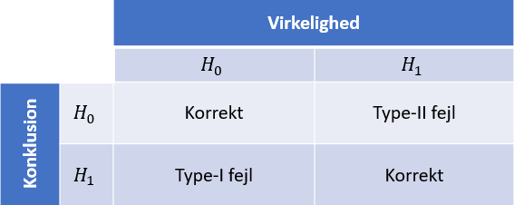

```{r include=FALSE, MESSAGE = FALSE}
library(mosaic)
```

__FIXME__ (Afsnittet skal kigges igennem, mhp. ILT! Noget af indledening til afsnittet minder om problemanalysen)

# Problemanalyse

## Statistikkens udvikling

Ordet _statistik_ stammer tilbage fra det latinske _statisticum collegium_ ("statsrådgiver") og det italienske _statista_ ("statsmand" eller "politiker"), [@Orddef]. At statistik netop stammer derfra, giver god mening, under anskueelse af betydningen af disse to ord og den tidlige anvendelse af statistik. I takt med udviklingen af suverænitetsstaterne, steg behovet for at registrere befolkningen og dennes tilhørselsforhold. Derfor anvendte statsrådgivere og statsmænd statistik til at beskrive staten, særligt demografien. Senerere blev dette udvidet til at indsamle flere informationer, og ligeledes at analysere og fortolke disse ved hjælp af statistik.

To statistikere, som ligger fundamentet til den statistiske arbejdsform, der bruges i dag er Karl Pearson og Ronald Fisher.
Karl Pearson var interesseret i at udvikle matematiske metoder til at studere biologisk arv og evolution. Gennem den interesse udsprang en række bidrag til statistiske analyse metoder. Pearson opfandt korrelationskoefficienten $(R^2)$ som bruges til at vise, hvor godt en regressionsmodel passer noget givent data. Udover det, opfandt han også $\chi^2$-testen, som er en metode der bruges til at teste at observerede værdier stemmer overens med de forventede værdier, [@KarlPearsonbrit], [@Chiianden].

Ronald Fisher introducerede princippet om randomisering. Det siger, at et eksperiment skal gentages på et antal kontrolgrupper, og de elementer der bruges i eksperimentet skal tilfældigt udvælges fra hele populationen. Dette gjorde data forventningsret, som mindsker variationen i et eksperiment. Udover det har Fisher introduceret analyse af varians, også kaldet ANOVA (fra engelsk analysis of variance). Denne model bruges til at analysere forskellen mellem gruppemiddelværdier i en stikprøve, [@RonaldFisher].

Yderligere har udviklingen af computeren været med til at gøre anvendelsen af komplicerede statistiske beregninger hurtigere, mere præcise og mere tilgængelige. Anvendelsesområderne for statistik har ligeledes udviklet sig, fra i begyndelsen at være noget staten anvendte til styring af økonomi og befolkningsindblik, til stort set at være repræsenteret i alle større hverv i dag. Den moderne definition af statistik kan beskrives som evnen til at drage konklusioner om generelle tilfælde, _populationer_, på baggrund af enkelte tilfælde, _stikprøver_, [@ASTAbog, s. 1].

## Statistiksk inferens

Det følgende afsnit er baseret på [@ASTAkursus1], [@ASTAkursus2] og [@ASTAkursus3].

I statistisk inferens differentieres der mellem to metoder, _estimering_ og _hypotesetest_. Når der estimeres på baggrund af en population, bruges stikprøven til at beskrive en ukendt del af populationen. Det kan for eksempel være gennemsnitsindkomst af danskere, $\mu$, for hvilken der findes et estimat $\hat{\mu}$, som bruges til at beskrive $\mu$. Dette betegnes som et punktestimat, og vil oftest suppleres med et intervalestimat. Årsagen til dette er, at punktestimater er tilfældige, og derfor ændrer sig fra stikprøve til stikprøve. Da punktestimaters sandsynlighed for at være korrekt derfor er lig $0$, tilstræbes det at anvende et intervalestimat, hvor det kan siges at $\mu$ med $95\%$ sikkerhed ligger, fremfor et punktestimat. Dette kaldes for et konfidensinterval.

Den anden form for statistisk infernes er hypotesetest. I hypotesetest opstilles først en nulhypotese, $H_0$, og en alternativ hypotese, $H_1 = \neg H_0$. Formålet med en hypotesetest er at indsamle nok evidens imod $H_0$, så den kan forkastes, hvilket giver ny viden omkring populationen. En nulhypotese kunne være, at danskere tjener det samme i gennemsnit som folk fra Sverige. Der vil ved hjælp af forskellige statistike metoder, ses om der er en signifikant forskel i gennemsnittet. Hvis dette er tilfældet, vil nulhypotesen forkastes og den alternative hypotese vil antages at være sand.

## Hypotesetest

I det følgende afsnit introduceres hypotesetests, samt hvorledes disse anvendes til at drage konklusioner for en population, ved at opstille to hypoteser.

En hypotesetest baserer sig på det videnskabelige princip om falsificering. Der opstilles en indledende formodning om en population, kaldet nulhypotesen $H_0$, og en alternativ, modsat hypotese $H_1$. Er den indledende formodning ikke korrekt, må den alternative hypotese være gældende.

Ved en hypotesetest undersøges, hvorvidt der er en difference mellem observerede værdier og forventede værdier, hvis $H_0$ er sand.

Sandsynligheden for at der er en difference er stor, eftersom der arbejdes på en stikprøve og ikke selve populationen, og derfor benyttes et mål for, hvornår differencen er _for_ stor, kaldet signifikansniveauet, $\alpha$.

En hypotesetest viser sandsynligheden for mulige udfald, for på den måde at undersøge, hvorvidt $H_0$ kan forkastes, [@HvorforHYPO].

Et mål for, hvor usandsynlig en observeret værdi er, hvis $H_0$ er sand, kaldes for en teststørrelse.

For at kunne bestemme, om en difference mellem en observeret og forventet værdi er signifikant, benyttes en signifikanstest. En signifikanstest er en metode til at finde teststørrelsen og undersøge, om den er signifikant eller ej.

Teststørrelsen findes ofte som antallet af standardafvigelser, den observerede værdi, $\hat \theta$, ligger fra den forventede værdi $\theta_0$.

At $\hat \theta$ ligger mere end $3$ standardafvigelser fra $\theta_0$, er højst usandsynligt, da $\hat \theta$ i så fald er en outlier i populationen. I et sådan tilfælde er $\theta_0$ højst sandsynligt ikke populationens korrekte værdi.

En illustration af teststørrelsens betydning ved en normalfordeling kan ses på Figur \@ref(fig:figur-Hypotesetest).

```{r, figur-Hypotesetest, out.width='75%', fig.align='center', fig.cap = "Teststørrelsens indflydelse på nulhypotesen", echo = FALSE}
knitr::include_graphics('images/HippoHyppo.jpeg')
```

Derudover benyttes testtørrelsen til at udregne _p_-værdien, som er sandsynligheden for at få en teststørrelse, der er lige så eller mere ekstrem, hvis $H_0$ er sand.

Værdien af teststørrelsen påvirker _p_-værdien på den måde, at når teststørrelsen bliver mere ekstrem, falder _p_-værdien. Jo mindre _p_-værdien er, des mindre stoles på $H_0$, og hvis _p_-værdien er mindre end signifikansniveauet, $\alpha$, forkastes $H_0$. Er _p_-værdien derimod større end $\alpha$, er der ikke belæg for at forkaste $H_0$ - dette betyder dog ikke, at $H_0$ givetvis er sand.

Normalt arbejdes der med et signifikansniveau på $5\%$, $\alpha=0.05$. Dog er der intet fast signifikansniveau og det kunne lige såvel være $10\%$ eller $1\%$. Betydningen heraf diskuteres kort sidst i afsnittet under fejltyper, [@ASTA-HYPO].

## Hypotesetest for middelværdier {#t-test}

__FIXME__ (Afsnittet kunne bruge lidt mere forklarende teskt) (Stadig nødvendigt? Det er vel beskrevet ret godt i afsnittet før?)

I dette afsnit gennemgås fremgangsmåden for, hvordan en hypotesetest kan bruges til at bestemme middelværdien for en population. I dette afsnit kaldes en sådan hypotesetest for en t-test. Afsnittet er skrevet på baggrund af [@ASTAkursus4].

Først er der nogle antagelser, der skal være opfyldt, for at t-testen ikke giver misvisende resultater.

1. Stikprøven er repræsentativ for populationen.
2. Variablen er kvantitativ.
3. Stikprøveudtagning er udført med tilfældighed.
4. Populationen er normalfordelt.

Herefter opstilles hypoteserne. Nulhypotesen, $H_0: \mu = \mu_0$ og den alternative hypotese $H_1: \mu \neq \mu_0$. Ligeledes sættes et signifikansniveau, $\alpha$, der vurderer med hvilken sikkerhed $H_0$ forkastes.

Derefter beregnes den observerede teststørrelse, $t_{obs} = \frac{|\bar y - \mu_o|}{\text{se}}$, hvor $\text{se} = \frac{s}{\sqrt{n}}$. Slutvist findes _p_-værdien, og på baggrund af denne, bliver nulhypotesen enten forkastet eller ej.

__Eksempel__

```{r include=FALSE}
set.seed(1)
n <- 10
forventet_middelvaerdi <- 0
xdata <- rnorm(n, forventet_middelvaerdi, 1)
x_middelvaerdi <- mean(xdata)
```

Der vil nu vises et eksempel på en t-test. Figur \@ref(fig:hist10) viser en stikprøve af ```r n``` observationer med en middelværdi på ```r x_middelvaerdi```, udtaget fra en standard normalfordelt population med en forventet middelværdi på $0$.

```{r hist10, echo=FALSE, fig.align='center', fig.cap = "Histogram over 10 simulerede standard normalfordelte tal."}
hist(xdata, main = NULL,
    ylab="Frekvens",
    xlab="Værdi")
```

I kodestykket nedenfor gennemgås den beskrevede fremgangsmåde for en t-test. I dette eksempel er $H_0: \mu = 0$, og $H_1: \mu \neq 0$.

```{r}
n <- 10
forventet_middelvaerdi <- 0 # Den forventede middelværdi er lig 0
xdata <- rnorm(n, forventet_middelvaerdi, 1) # Der udtages en tilfældig normalfordelt stikprøve
middelvaerdi <- mean(xdata) # Middelværdien af stikprøven udregnes
standardafvigelse <- sd(xdata) # Standardafvigelsen af stikprøven udregnes

estimeret_standardfejl <- standardafvigelse/sqrt(n) # Stikprøvens estimerede standardfejl udregnes

t_obs <- (abs(middelvaerdi-forventet_middelvaerdi))/estimeret_standardfejl
  # Den observerede teststørrelse udregnes

alpha_halve <-  1 - pdist("t", q = t_obs, df = n-1, plot = FALSE)
p <- 2 * alpha_halve # p-værdien udregnes
```

```{r include=FALSE}
forventet_meanx <- -0.5
t_obsx <- (abs(middelvaerdi-forventet_meanx))/
  estimeret_standardfejl
x_p = 2 * (1 - pdist("t", q = t_obsx, df = n-1, plot = FALSE))
```

Eftersom *p*-værdien er ```r p``` $> \alpha=0.05$, forkastes $H_0$ ikke. Havde det derimod været en forventet værdi på ```r forventet_meanx```, ville *p*-værdien blive ```r x_p``` $< \alpha=0.05$, hvilket vil medføre, at $H_0$ forkastes og det vil formodes, at $H_0$ ikke er korrekt for populationen.

### Fejltyper {#fejltyper-afsnit}

Der er risiko for to primære fejl når der foretages en hypotesetest, som illustreret på figur \@ref(fig:figur-typefejl). Den første, type-I fejl, er hvor $H_0$ forkastes, men i virkeligheden er sand, og den anden, type-II fejl, er hvor $H_0$ accepteres, men i realiteten er falsk.

En af de primære årsager til disse typer fejl er, hvor signifikansniveauet bliver sat, da dette i nogle tilfælde har stor betydning for, hvorvidt en hypotese bliver forkastet eller ej.

Sandsynligheden for type-I fejl er lig med det valgte signifikansniveau, $\alpha$. Sandsynligheden for type-II fejl, $\beta$, er derimod ikke let at præcisere. Dog er der stor sandsynlighed for type-II fejl, hvis den virkelige sandhed er tæt på nulhypotesen. Er den virkelige sandhed derimod langt fra nulhypotesen, vil sandsynligheden for type-II fejl være tilsvarende lille. Ligeledes har stikprøvens størrelse indflydelse, eftersom meget data mindsker risikoen for type-II fejl, hvor der er større risiko ved en mindre mængde data. Andelen af type-II fejl benyttes til at udregne hypotesetestens styrke, $1-\beta$. Styrken annoterer andelen af gange, hvor $H_1$ korrekt bliver forkastet, [@Fejltyper].

```{r figur-typefejl, out.width='75%', fig.align='center', fig.cap = "Tabel over fejltyper", echo = FALSE}

```

Det vil påvises, hvilken betydning små differencer i middelværdien samt stikprøvestørrelsen har for andelen af type-II fejl.

```{r, echo=FALSE}
set.seed(1)
type_2_vector <- c()
reps <- 1000
for(stik in c(5, 10, 25, 50, 200, 1000, 10000)){ # Stik størrelse
  for(mdiff in c(0.001, 0.1, 1, 2, 5)){ # Mu difference
    
    forv_dif <- 0 # Forventet diff
    
    res <- replicate(reps, {
      x1 <- rnorm(stik, 1 + mdiff, 1)
      x2 <- rnorm(stik, 1, 1)
    
      t_res <- t.test(x1, x2, alternative = "two.sided", conf.level = 0.95)
    
      konfinterval <- t_res$conf.int
    
      konfinterval[1L] <= forv_dif & konfinterval[2L] >= forv_dif
    })
    type_2_vector <- append(type_2_vector, table(res)[2]) # 
  }
}
type_2_vector[is.na(type_2_vector)] <- 0 # Ændre NA til 0
type_2_vector <- type_2_vector / reps # Omregner til %

type_2 <- matrix(type_2_vector, nrow = 5, ncol = 7, dimnames = list("Differencen i middelværdi" = c("0.001", "0.1", "1", "2", "5"), "Stikprøvestørrelsen, n =" = c("5", "10", "25", "50", "200", "1000", "10000")))
type_2
```

Tabellen viser, at både stikprøvestørrelsen samt differencen i middelværdien, har stor betydningfor andelen af aftype-II fejl. Er differencen i middelværdierne $0.001$ fremgår det, at stikprøvestørrelsen mellem $5$ og $10,000$ ikke giver signifikante forskelle, hvilket medfører, at stikprøvestørrelsen skal være meget større for at mindske andelen af type-II fejl. Derudover mindskes risikoen for type-II fejl som stikprøvestørrelsen øges, hvilket også er gældende hvis differencen i middelværdierne forøges.

### Uparret t-test for ikke-normalfordelte stikprøver {#t-test2}

I nogle tilfælde er det ikke muligt at overholde alle de pågældende antagelser, som beskrevet i afsnit \@ref(t-test), der hører til en t-test når der udføres statistisk inferens. Når dette sker, kan det ikke altid antages, at resultaterne er retvisende. I dette afsnit vil det vises, hvad der kan ske, hvis stikprøverne ikke er normalfordelte, når der arbejdes med en uparret t-test.

I dette eksempel benyttes betafordelingen, se figur \@ref(fig:figurpop1), og gammafordelingen, se figur \@ref(fig:figurpop2), til at udføre en uparret t-test.

```{r figurpop1, fig.align="center", echo=FALSE, fig.cap= "Tæthedskurve for venstreskæv betafordeling, hvor alfa = 8 og beta = 2"}
x <- seq(0, 1, length.out = 100)
y <- dbeta(x, shape1 = 8, shape2 = 2)
plot(x, y, type = "l", main = "", ylab = "", xlab = "")
```

```{r figurpop2, fig.align="center", echo=FALSE, fig.cap= "Tæthedskurve for højreskæv gammafordeling, hvor alfa = 1 og beta = 2."}
x <- seq(0, 1, length.out = 100)
y <- dgamma(x, shape = 1,  rate = 2)
plot(x, y, type = "l", main = "", ylab = "", xlab = "")
```

Nulhypotesen er $H_0: \mu_1 - \mu_2 = 0$ og den alternative hypotese er $H_1 : \mu_1 - \mu_2 \neq 0$. Denne nulhypotese undersøges ved hjælp af en uparret t-test. Der udtages en stikprøve fra hver af de viste fordelinger, som der udføres to-sidet uparret t-test på, ved hjælp af den indbyggede funktion `t.test`.

```{r, tidy=TRUE}
#t.test ud fra de to stikprøver
Stik1 <- rbeta(100, 8, 2)
Stik2 <- rgamma(100, 1, 2)
t1 <- t.test(Stik1, Stik2, alternative = "two.sided", mu = 0, conf.level = 0.95)
```

Udfra t-testen fås et konfidensinterval på [```r round(t1$conf.int, 4)```]. Forskellen mellem populationernes middelværdier vil ligge i dette interval med $95\%$ sikkerhed, ifølge t-testen. Dækningsgraden af et konfidensinterval udarbejdet fra en uparret t-test kan undersøges ved at trække nye stikprøver fra populationerne, i alt $10,000$ gange, og hver gang oprette et nyt konfidensinterval. Den sande dækningsgrad er andelen af gangene, forskellen mellem populationernes middelværdier er indeholdt i konfidensintervallerne.

```{r ronni, fig.cap= "Kode test"}
#Undersøg dækningsgraden af konfidensintervallet ved udtræk af nye stikprøver.
set.seed(31415)

middel1 <- 8/(8+2)
middel2 <- 1*(1/2)

sand_dif <- abs(middel1 - middel2)

res <- replicate(10000, {
  x1 <- rbeta(20, 8, 2)
  x2 <- rgamma(20, 1, 2)

  t_res <- t.test(x1, x2, alternative = "two.sided", conf.level = 0.95)

  konfinterval <- t_res$conf.int

  konfinterval[1L] <= sand_dif & konfinterval[2L] >= sand_dif
})

tf <- table(res)
tf
```

Det fremgår fra tabellen, at dækningsgraden af konfidensintervallerne er ```r tf[2]/100```$\%$. Dette stemmer ikke overens med antagelsen om, at konfidensintervallet har en dækningsgrad på $95\%$. Det kan derfor ikke antages, at en t-test på en ikke-normalfordelt stikprøve altid giver retvisende resultater.

## Problemformulering

_Kan simuleringsstudier bidrage til at højne kvaliteten af dataanalyser, og i så fald, hvordan?_

_??_

_Hvilke alternativer er der til t-testen når dens antagelser ikke er overholdt, og hvor robuste er de?_

__FIXME:__ arbejdsspørgsmål i samme rækkefølge som i rapporten. Ret løbende.
