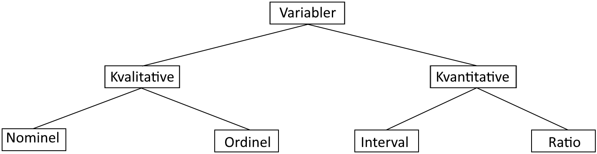

# Variabeltyper

Inden en dataanalyse påbegyndes er det vigtigt at undersøge, hvilke typer af variabler, der indgår. Der findes forskellige slags, alt efter, hvilken værdi de har, og det har indflydelse på, hvilke typer af matematiske operationer, man kan udføre på dem. I dette afsnit gennemgåes de forskellige variabeltyper, som er vist på Figur \@ref(fig:figur-variabeltyper).

```{r, figur-variabeltyper, out.width='75%', fig.align='center', fig.cap="Oversigt over forskellige variabeltyper", echo = FALSE}

```

## Kvalitative variabler

Variabler kan opdeles i kategoriske eller kvalitative variabler. Ved en kvalitativ variabel fremgår der en enhed, som er den enhed der kategoriseres efter. Udfaldsmængden er de mulige værdier, som kan forekomme ved en undersøgelse af enheden. Dette kunne eksempelvis være nationalitet, hvor der kategoriseres efter land, hvor udfaldsmængen er landene i verden.

De kvalitative variabler er opdelt efter en nominel og ordinel skala.

Den nominale beskriver variabler, som ikke har en naturlig rangorden, og derved ikke kan rangeres. Ofte er de nominale variabler tekststrenge, men de kan også være numeriske i form af postnumre, dog vil det være meningsløst at foretage beregninger såsom middelværdi eller standardafvigelsen. Eksempler på nominale variabler er køn, hudfarve, nationalitet og hårfarve, da udfaldsmængden i enheden ikke kan rangordnes. Derved skal nominale variabler illustreres ved et cirkeldiagram, da der ikke er givet nogen skala. De udregninger, som der kan foretages på nominale variabler er andele og frekvenser, da disse kun kan skelne udfald.

De ordinale variabler er de kvalitative variabler, som kan rangeres. Eftersom udfaldsmængden er naturligt rangeret, og samtidig er kategorisk, vil det altså være en ordinal variabel. Eksempler på ordinale variabler er økonomisk status, uddannelsesgrad og karakterer. Disse variablers udfaldsmængde er altså rangeret i forhold til hinanden, da det er bedre at være i en høj indkomst fremfor en lav indkomst og ligeledes er det bedre at få karakteren 10 end karakteren 4. Ud fra observationerne kan man efterfølgende blandt andet finde medianen, kvartiler m.m.

Ønsker man at finde middelværdien skal man være lidt påpasselig, eftersom det reelt set ikke giver nogen mening på ordinale variabler. Dog er det muligt at udregne en middelværdi, hvis der er en fælles forståelse af, hvad middelværdien betyder for enheden og hvilken skala, det er udregnet på baggrund af. Når ordinale variabler illustreres, skal det gøres som et søjlediagram efter rangordenen. [@ASTAbog s. 12-13]

## Kvantitative variabler

Kvantitative variabler er defineret ved en numerisk  værdi, hvilket gør variablerne målbar. Da en kvantitativ variabel antager en numerisk værdi, kan aritmetriske operationer udføres på variablen. På baggrund af disse simple operationer er det muligt at få informationer ud af et datasæt, der kan skabe indsigt i forhold til fokusområder, som skal undersøges yderligere. Dette er en væsentlig del af dataanalyse, således at ressourcer kan anvendes optimalt.

Et andet essentielt værktøj i dataanalyse er visualisering. På baggrund af middelværdi, varians og standardafvigelse, er det muligt at visualisere data med eksempelvis et histogram eller et boksplot.

Kvantitative variabler kan opdeles i to underkategorier, interval og ratio. Derudover kan disse underkategorier inddeles yderligere i diskrete og kontinuerte variabler. Disse beskrives i et efterfølgende afsnit.

Variabler, der tilhører intervalkategorien, er defineret som variabler, hvor det er muligt at bestemme forskellen mellem to mængder eller to tal. Det kunne eksempelvis være forskellen på temperaturen indenfor, $20 ~^\circ C$, og udenfor, $10 ~^\circ C$.

Variabler, der tilhører ratiokategorien, er defineret som variabler, hvor det er muligt at bestemme forholdet mellem to mængder eller to tal. Det betyder, at der mellem to tal skal være et særligt forhold. Som eksempel på værdier, der tilhører ratiokategorien, kan være antal hår på hovedet, fart, temperatur målt i kelvin eller tidsforskel. Årsagen til, at temperaturer målt i kelvin, men ikke temperaturer målt i grader celsius, tilhører ratiokategorien er, at værdier i denne kategori skal have et naturligt nulpunkt.

### Diskrete variabler

En underkategori til kvantitative variabler er diskrete variabler. En variabel er diskret, hvis man kan tælle værdierne i den, som eksempelvis øjne på en terning. Enhver variabel der kan beskrives, som “antallet af…” er en diskret variabel. Værdierne i en diskret variabel er heltal, eksempelvis kan det ikke siges, at en person har 2,5 søskende.

Nominale og ordinale variabler er diskrete variabler. Det kan dog være forvirrende at kende forskel på diskrete og kontinuerte variabler, da man ofte afrunder kontinuerte variabler til heltal når man måler dem, så de bliver diskrete. Alder er ét eksempel på en afrunding af et kontinuert tal. Eksempelvis siger man typisk 21 år, når man faktisk er mellem 21 og 22 år. Grunden til, at det er vigtigt at genkende om variablen er kontinuert eller diskret, er at den viden bruges til at bestemme, hvilken statistisk metode, der skal benyttes til dataanalysen. [@ASTAbog]


### Kontinuerte variabler

Hvis en variabels værdier tilhører en overtællelig mængde, siges den at være kontinuert. Et eksempel på en kontinuert variabel, kan være højden på et tilfældigt menneske i en population. Her kan højden have et antal decimaler, der går mod uendeligt, for eksempel $195,00000003$ cm.

For kontinuerte variabler bruger man tæthedsfunktionen, f(x). Her er arealet, hvilket svarer til 1, altså 100 procent, under tæthedsfunktionen sandsynligheden for, at en variabel, X, befinder sig i intervallet [a, b], givet ved

$P(a \leq X \leq b) = \int_a^b f(x) dx$

Den typiske kontinuerte fordeling er en normalfordeling. Dels fordi den fremgår i mange målinger i virkeligheden, og dels fordi, den centrale grænseværdisætning siger, at ved et højere antal observationer, vil alle variablers gennemsnitsfordeling antage en normalfordeling.

## Stokastike variabler

En stokatisk variabel, $X$, er en funktion, som afbilleder fra mulige udfald af et eksperiment til et tal. Ved at definere en stokastisk variabel, gøres det nemmere at arbejde med hændelser og deres sandsynligheder. Derudover er stokastiske variabler særligt anvendelige i de tilfælde hvor et udfald ikke er defineret ved en talværdi, eksempelvis plat eller krone. [@Stokvar]

>```{definition}
> En stokastisk variabel er en funktion, $X$, som til ethvert udfald af et eksperiment, $\omega \in \Omega$, $X(\omega) \in E$. $E$ kaldes for udfaldsrummet.
>```

<!-- FIXME Find en kilde der ikke er wiki, evt. lærebogen.  -->
<!-- En stokastisk variabel kan defineres som en afbildning $X$ fra et $\Omega$-rum til et udfaldsrum $E$. Der er altså et underliggende $\omega$, der er skyld i observationen $X(\omega)$.  -->
<!-- ( Taget fra wiki, https://da.wikipedia.org/wiki/Stokastisk_variabel) -->

Eksempel:

Et eksperiment med sten, saks og papir, er der tre mulige udfald. Disse udfald er ikke givet på nogen talværdi. Derfor defineres en stokastisk variabel, $X$, hvor sten tilknyttes til 0, saks til 1 og papir til 2. Dermed er den stokastiske variabel, $X$, givet ved:  
$X : \{Sten, saks, papir\} \rightarrow \{0, 1, 2\}$

Stokastiske variabler kan beskrives som _diskrette_ eller _kontinuerte_, hvilket afhænger af de mulige udfald.
