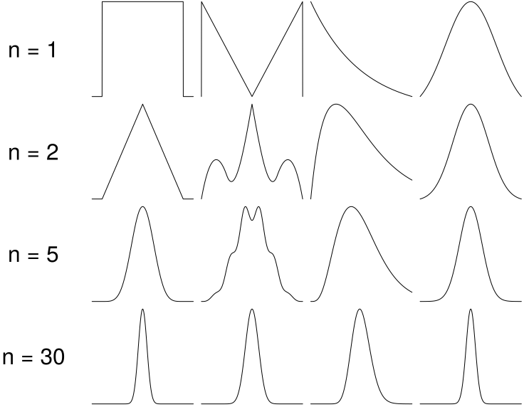

# Faldgruber i en dataanalyse

Der er flere forskellige forhold at tage hensyn til, inden en dataanalyse påbegyndes. Nogle eksempler på disse forhold gennemgåes i dette kapitel, herunder variabeltyper, estimatorens egenskaber, fordelinger og antallet af kovariater. Afsnittet er primært skrevet med inspiration fra [@ASTAbog] og [@ASTAkursus3].

## Variabeltyper

I dette afsnit gennemgåes, hvilken indflydelse variabeltyper har på en dataanalyse, samt andre faktorer, der skal tages hensyn til, før en korrekt dataanalyse kan udføres. Dette gøres for at give et overblik over, hvilke umiddelbare risici der er for både almindelige tastefejl, og fejlagtige matematiske operationer.

Som nævnt i __AFSNITTET__, findes der forskellige typer af variable. Dette er en vigtig faktor at tage hensyn til, da det har indflydelse på, hvilke matematiske operationer, der kan udføres på variablen. Desuden har variabeltypen indflydelse på, hvilken type diagram de kan illustreres i. En kort opsummering af, hvilke operationer, der kan udføres på hvilke variable, ses på tabellen nedenfor.

Table: En oversigt over de forskellige variable, og hvilke typer af matematiske operationer, der kan udføres på dem.

|  Kvalitative variable   |      Kvantitative variable           ||
|-------------|-----------|-------------------|-------------------|
| __Nominal__ |__Ordinal__| __Interval__      | __Ratio__         |
|    Andel    |   Median  | Middelværdi       | Middelværdi       |
|   Frekvens  | Kvartiler | Standardafvigelse | Standardafvigelse |

Generelt gælder det, at hvis en variabel tillader en bestemt operation, tillades samme operation på variabler, der står til højre i tabellen.

En anden væsentlig, omend ikke lige så matematisk faldgrube, er symboler. Der defineres nøjagtigt, hvad en parameter, et estimat og en estimator er, og de hver et specifikt symbol. Generelt gælder, at græske bogstaver definerer en parameter, det tilsvarende latinske bogstav et estimat, og et stort latinsk bogstav en estimator. I tabellen nedenfor er det opsummeret, hvad fire forskellige parametre er givet som, og hvad det tilsvarende er i stikprøven og estimatoren.

Table: En oversigt over de forskellige symboler, som angiver henholdsvis en parameter, et estimat og en estimator.

| Population (Parametre) | Stikprøve (Estimater) | Estimatorer |
|:-----------:|:---------:|:---------:|
|      my     |   my_hat  |   My_hat  |
|   sigma     |     s     |     S     |
|  sigma^2    |    s^2    |    S^2    |
|      pi     |   pi_hat  |   Pi_hat  |

Det er derfor klart, at der skal være enighed om, hvad en parameter og et estimat er, og hvad forskellen er på et estimat og en estimator, før en dataanalyse kan udføres korrekt.


## Estimatorens egenskaber

I dette afsnit gennemgåes de forskellige egenskaber, unbiased, efficient, konsistent og sufficient, en estimator kan have. Disse begreber giver et indblik i, hvor god en estimator er, og derved også, hvor valide resultater, en dataanalyse på baggrund af den estimator, vil bibringe.

En estimator er en stikprøvefunktion, der udfører en beregning på baggrund af værdier i en stikprøve, for at estimere parametrene i en population. Eksempelvis er middelværdi, $mean = \frac{\sum observationer}{\# observationer}$, en estimator, der beregner et estimat for en populations middelværdi.

Der findes overordnet set fire forskellige måder at måle, hvorvidt en estimator er passende for ens data. Disse er, om estimatoren er forventningsret, efficient, konsistent og sufficient, som defineret nedenfor. 

>```{definition}
>__Estimatorers egenskaber__ [@ASTAkursus3]
>
> _Forventningsret_: Den forventede værdi for en forventningsret estimator er lig parameteren $E(\hat{Y}) = \mu$.
>
> _Efficient_: En efficient estimator er den estimator med lavest varians.
>
> _Konsistent_: Variansen af en konsistent estimator falder, når størrelsen af stikprøven stiger.
>
> _Sufficient_: For en sufficient estimator gælder det, at når estimatet er beregnet, skal stikprøven ikke indeholde yderligere informationer om parameteret.
> ```

Hver af disse egenskaber har indvirkning på, hvor brugbare resultater, en dataanalyse vil bibringe. En estimator, der ikke er forventningsret, vil ikke give et korrekt bud på populationens middelværdi. Ligeledes vil en estimator, der ikke er efficient, have en større varians end mindst en anden estimator, hvilket leder til mindre brugbare resultater. Det er derfor vigtigt, at en estimator undersøges grundigt, og dens egenskaber bestemmes, inden den tages i brug.

## Populationens fordeling

I dette afsnit gennemgåes, hvilken indflydelse en populations fordeling har på fordelingen af estimaterne og de tilhørende estimatorer. Dette er nødvendigt, da forskellige regneregler og metoder, der gælder for, eksempelvis, en normalfordeling ikke nødvendigvis gælder for, eksempelvis, en uniform fordeling. Desuden har fordelingen af populationen indflydelse på, hvordan fordelingen af stikprøven og estimatorerne er.

Givet en population med en ukendt fordeling $Y \sim ?(\mu, \sigma)$, virker det umiddelbart ikke klart, hvordan en stikprøve kan benyttes til at infere. Dog siger den centrale grænseværdi sætning, at stikprøvemiddelværdien vil være normalfordelt, $\hat{y} \sim n(\mu, \frac{\sigma}{\sqrt{n}})$.

>```{theorem}
>__Den Centrale Grænseværdisætning__ [@ASTAbog, s. 93].
>
> Ved tilfældig stikprøveudtagning af tilpas stor størrelse, vil fordelingen af stikprøvegennemsnittet blive tilnærmelsesvist normalfordelt med middelværdi $$\mu$$ og varians $\frac{\sigma}{\sqrt{n}}$.
>```

```{r, out.width='75%', fig.align='center', fig.cap="Figurtekst, [@ASTAkursus2]", echo = FALSE}

```

- Population højreskæv -> estimat højreskæv og estimator højreskæv
- Generel foldningsregel
- Den centrale grænseværdisætning
    - Cochrans regel


