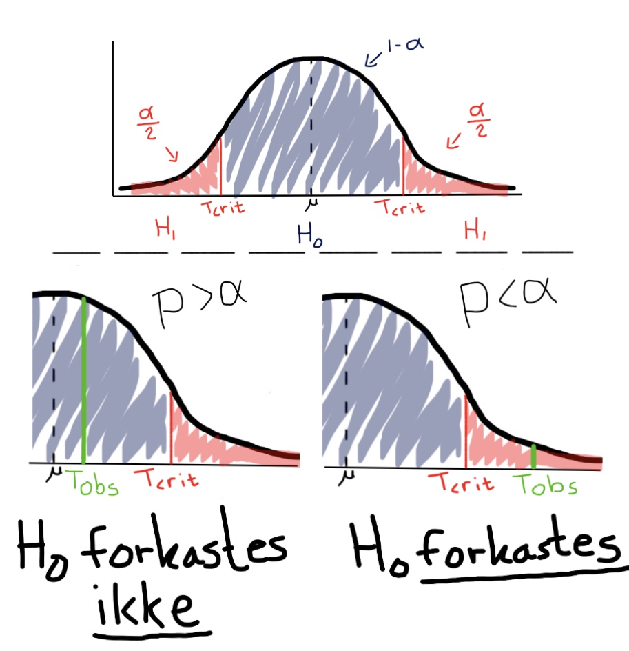
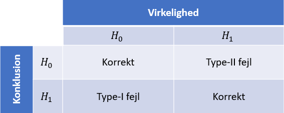
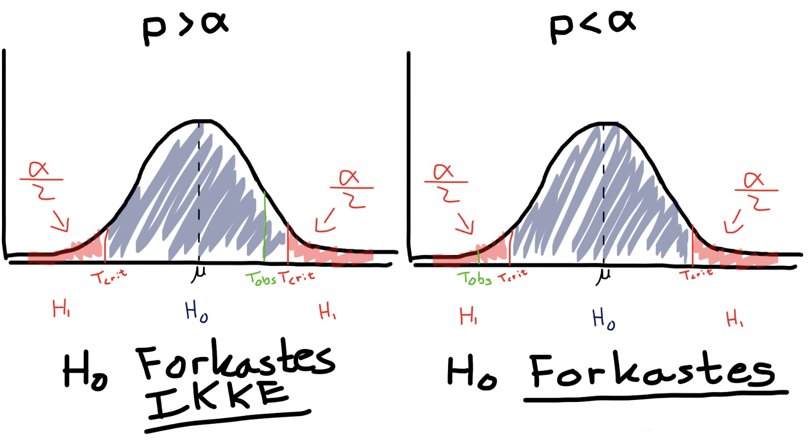

```{r include=FALSE, MESSAGE = FALSE}
library(mosaic)
```

# Hypotesetest

En hypotesetest baserer sig på det videnskabelige princip om falsificering. Der opstilles en indledende formodning om en population, kaldet nulhypotesen $H_0$, og en alternativ, modsat hypotese $H_1$. Er den indledende formodning ikke korrekt, må den alternative hypotese være gældende.

Ved en hypotesetest undersøges, hvorvidt der er en difference mellem observerede værdier og forventede værdier, hvis $H_0$ er sand.

Sandsynligheden for at der er en difference er stor, eftersom der arbejdes på en stikprøve og ikke selve populationen, og derfor benyttes et mål for, hvornår differencen er _for_ stor, kaldet signifikansniveauet, $\alpha$.

En hypotesetest viser sandsynligheden for mulige udfald, for på den måde at undersøge, hvorvidt $H_0$ kan forkastes. [@HvorforHYPO] 

Et mål for, hvor usandsynlig en observeret værdi er, hvis $H_0$ er sand, kaldes for en teststørrelse.

For at kunne bestemme, om en difference mellem en observeret og forventet værdi er signifikant, benyttes en signifikanstest. En signifikanstest er en metode til at finde teststørrelsen og undersøge, om den er signifikant eller ej.

Teststørrelsen findes ofte som antallet af standardafvigelser, den observerede værdi, $\hat \theta$, ligger fra den forventede værdi $\theta_0$.

At $\hat \theta$ ligger mere end $3$ standardafvigelser fra $\theta_0$, er højst usandsynligt, da $\hat \theta$ i så fald er en outlier i populationen. I et sådan tilfælde er $\theta_0$ højst sandsynligt ikke populationens korrekte værdi.

En illustration af teststørrelsens betydning ved en normalfordeling kan ses på Figur \@ref(fig:figur-Hypotesetest).

```{r, figur-Hypotesetest, out.width='75%', fig.align='center', fig.cap = "Teststørrelsens indflydelse på nulhypotesen", echo = FALSE}

```

Derudover benyttes testtørrelsen til at udregne _p_-værdien, som er sandsynligheden for at få en teststørrelse, der er lige så eller mere ekstrem, hvis $H_0$ er sand.

Værdien af teststørrelsen påvirker _p_-værdien på den måde, at når teststørrelsen bliver mere ekstrem, falder _p_-værdien. Jo mindre _p_-værdien er, des mindre stoles på $H_0$, og hvis _p_-værdien er mindre end signifikansniveauet, $\alpha$, forkastes $H_0$. Er _p_-værdien derimod større end $\alpha$, er der ikke belæg for at forkaste $H_0$ - dette betyder dog ikke, at $H_0$ givetvis er sand.

Normalt arbejdes der med et signifikansniveau på $5\%$, $\alpha=0.05$. Dog er der intet fast signifikansniveau og det kunne lige såvel være $10\%$ eller $1\%$. Betydningen heraf diskuteres kort sidst i afsnittet under fejltyper. [@ASTA-HYPO]

## Hypotesetest for middelværdier (t-test)

I dette afsnit gennemgåes fremgangsmåden for, hvordan en hypotesetest kan bruges til at bestemme middelværdien for en population. En sådan hypotesetest kaldes en t-test.

Først er der nogle antagelser, der skal være opfyldt, for at t-testen ikke giver misvisende resultater.

1. Variablen er kvantitativ.
2. Stikprøveudtagning er udført med tilfældighed.
3. Populationen er normalfordelt.

Herefter opstilles hypoteserne. Nulhypotesen, $H_0: \mu = \mu_0$ og den alternative hypotese $H_1: \mu \neq \mu_0$.

Dernæst sættes et signifikansniveau, $\alpha$, der vurderer med hvilken sikkerhed $H_0$ forkastes.

Derefter beregnes den observerede teststørrelse, $t_{obs} = \frac{|\bar y - \mu_o|}{\text{se}}$, hvor $\text{se} = \frac{s}{\sqrt{n}}$.

Til slut findes _p_-værdien, og på baggrund af denne, bliver nulhypotesen enten forkastet eller ej.

### Eksempel

I dette afsnit gennemgåes et eksempel på en t-test.

```{r include=FALSE}
set.seed(1)
n <- 10
forventet_middelvaerdi <- 0
xdata <- rnorm(n, forventet_middelvaerdi, 1)
x_middelvaerdi <- mean(xdata)
```

Følgende histogram viser en stikprøve af ```r n``` observationer med en middelværdi på ```r x_middelvaerdi```, udtaget fra en standardnormalfordelt population med en forventet middelværdi på $0$.

```{r, echo=FALSE, fig.align='center', fig.cap = "Histogram over 10 simulerede standardnormalfordelte tal."}
hist(xdata, main = NULL,
     ylab="Frekvens",
     xlab="Værdi")
```

I kodestykket nedenfor gennemgås den beskrevede fremgangsmåde for en t-test.

```{r}
n <- 10
forventet_middelvaerdi <- 0 # Forventet middelværdi
middelvaerdi <- mean(xdata) # Middelværdi
standardafvigelse <- sd(xdata) # Standardafvigelsen
estimeret_standardfejl <- standardafvigelse/sqrt(n) # Estimeret standardfejl
t_obs <- (abs(middelvaerdi-forventet_middelvaerdi))/estimeret_standardfejl # Observeret teststørrelse
alpha_halve <-  1 - pdist("t", q = t_obs, df = n-1, plot = FALSE)
p <- 2 * alpha_halve
```

```{r include=FALSE}
# Viser hvis forventede mean havde været lavere
forventet_meanx <- -0.5
t_obsx <- (abs(middelvaerdi-forventet_meanx))/estimeret_standardfejl # Observeret teststørrelse
x_p = 2 * (1 - pdist("t", q = t_obsx, df = n-1, plot = FALSE))
```

Eftersom *p*-værdien er ```r p``` $> \alpha=0.05$, forkastes $H_0$ ikke. Havde det derimod været en forventet værdi på ```r forventet_meanx```, ville *p*-værdien blive ```r x_p``` $< \alpha=0.05$, hvilket vil medføre, at $H_0$ forkastes og det vil formodes, at $H_0$ ikke er korrekt for populationen.

## Fejltyper

Der er risiko for to primære fejl når der foretages en hypotesetest. Den første, type-I fejl, er hvor $H_0$ forkastes, men i virkeligheden er sand, og den anden, type-II fejl, er hvor $H_0$ accepteres, men i realiteten er falsk.

En af de primære årsager til disse typer fejl er, hvor signifikansniveauet bliver sat, da dette i nogle tilfælde har stor betydning for, hvorvidt en hypotese bliver forkastet eller ej.

Sandsynligheden for type-I fejl er lig med det valgte signifikansniveau - i de fleste tilfælde $5\%$. Sandsynligheden for type-II fejl er derimod ikke let at præcisere. Dog er der stor sandsynlighed for type-II fejl, hvis den virkelige sandhed er tæt på nulhypotesen og lille, hvis den er langt fra. Ligeledes har stikprøvens størrelse indflydelse, eftersom meget data mindsker risikoen for type-II fejl, hvor der er større risiko ved mindre data. [@Fejltyper]

```{r, figur-typefejl, out.width='75%', fig.align='center', fig.cap = "Tabel over fejltyper", echo = FALSE}

```

FIXME: Skriv om 'styrken' (jævnfør arbejdsblad fra 26/3)


<!-- GAMMELT -->

<!-- En hypotesetest er givet ved en formodning, derved hypotese, om en given population forholder sig på en bestemt måde, hvilket der undersøges. Heraf opstilles to hypoteser. En nulhypotese, $H_0$, og en alternativ hypotese $H_1$. Nulhypotesen er den antagelse der er taget, hvor den alternative hypotese påviser at det ikke er tilfældet, og derved at noget andet er gældende.   -->

<!-- Grunden til at benytte en hypotesetest er, at undersøge, hvorvidt differencen på $H_0$ og den observerede værdi fra datasættet er sandsynlig. Sandsynligheden for en difference er stor, eftersom der arbejdes på en stikprøve og ikke selve populationen. -->

<!-- En hypotesetest evaluerer sandsynligheden for mulige udfald, for på den måde at kunne forkaste $H_0$ eller ej. [@HvorforHYPO] -->

<!-- For at kunne undersøge, hvorvidt der er en signifikant forskel mellem stikprøven og hypotesen benyttes en signifikanstest. For at kunne evaluere om en difference er signifikant, opstilles testtørrelsen og _p_-værdien findes. -->

<!-- Teststørrelsen sammenligner stikprøven med den forventede værdi fra $H_0$, og indikerer, hvor mange standardafvigelser stikprøven er fra $H_0$. Afhængig af den valgte hypotesetest benyttes forskellige teststørrelser. T-test benytter t-teststørrelse, hvor ANOVA benytter F-teststørrelse osv. [@TEST-HYPO] -->

<!-- Teststørrelsen findes ofte ved $T(\hat\theta, \theta_0) =$ "# standardafvigelser fra $\hat\theta$ til $\theta_0$", hvor $\hat\theta$ er den estimerede værdi og $\theta_0$ er den forventede værdi fra $H_0$. Denne værdi kendetegnes ved den observerede værdi af t, $t_{obs}$. -->

<!-- Det vil være meget usandsynligt at $\hat\theta$ er mere end 3 standardafvigelser fra $\theta_0$, hvilket ville påpege, at $\theta_0$ højst sandsynligt ikke er populationens korrekte værdi. [@ASTA-HYPO] -->

<!-- En illustration af teststørrelsens betydning ved en normalfordeling kan ses i figuren herunder. FIXME referer til figuren. -->

<!-- FIXME: Figuren er lidt utydelig. De kritiske punkter skal være mere synlige. Eventulet zoom ind på halerne. -->

<!-- ```{r, figur-Hypotesetest, out.width='75%', fig.align='center', fig.cap = "Teststørrelsens indflydelse på nulhypotesen", echo = FALSE} -->
<!--  -->
<!-- ``` -->

<!-- Derudover benyttes testtørrelsen til at udregne _p_-værdien. Værdien af teststørrelsen påvirker _p_-værdien, og hvis testtørrelsen bliver for stor medfører det, at _p_-værdien bliver lille nok til at kunne forkaste $H_0$. Altså, jo mindre _p_-værdien er, des mindre stoles der på $H_0$. Hvis $p<\alpha$ forkastes $H_0$, hvor $p>\alpha$ ikke giver grundlag til at forkaste $H_0$. Normalt arbejder man med et signifikansniveau på 5%, $\alpha=0.05$. Dog er der intet fast signifikansniveau og det kunne lige såvel være 10% eller 1%. Betydningen heraf diskuteres kort sidst i afsnittet under fejltyper. [@ASTA-HYPO] -->


<!-- ## Hypotesetest på normalfordeling -->

<!-- På baggrund af en normalfordeling er det muligt at lave en hypotesetest ud fra følgende med en t-test.   -->

<!-- * Først sættes et signifikansniveau, $\alpha$, som vurderer med hvilken sikkerhed $H_0$ forkastes eller ej. -->

<!-- * Herefter udregnes estimater for parametrene af populationen, middelværdien, $\hat \mu = \bar y$ og standardafvigelsen, $\hat \sigma = s$ ud fra $n$ observationer. -->

<!-- * En nulhypotese: $H_0 : \mu = \mu_0$ og en alternativ hypotese: $H_1 : \mu \neq \mu_0$ opstilles, hvor $\mu_0$ er den forventede værdi, hvis nulhypotesen er sand. -->

<!-- * Herefter kan den observerede teststørrelse, $t_{obs} = \frac{|\bar y - \mu_o|}{\frac{s}{\sqrt{n}}}$ udregnes. -->

<!-- <!-- * Frihedsgrader, $df = n-1$. FIXME: Beskriv antallet af frihedsgrader tidligere. -->

<!-- * *p*-værdien, som kan slåes op på baggrund af antal frihedsgrader og signifikantniveauet, eller findes i R ved ```2 * (1 - pdist("t", q = t_obs, df = n-1))```. -->

<!-- ```{r include=FALSE} -->
<!-- set.seed(1) -->
<!-- n <- 10 -->
<!-- forventet_middelvaerdi <- 0 -->
<!-- xdata <- rnorm(n, forventet_middelvaerdi, 1) -->
<!-- x_middelvaerdi <- mean(xdata) -->
<!-- ``` -->

<!-- ```{r, echo=FALSE, fig.align='center', fig.cap = "Histogram over 10 simulerede standardnormalfordelte tal."} -->
<!-- hist(xdata, main = NULL, -->
<!--      ylab="Frekvens", -->
<!--      xlab="Værdi") -->
<!-- ``` -->

<!-- Med et normalfordelt datasæt er det muligt at undersøge om der er evidens imod hypotesen. Eksempelvis benyttes et datasættet over af ```r n``` observationer med en middelværdi på ```r x_middelvaerdi``` og en forventet middelværdi på ```r forventet_middelvaerdi```, så kan der undersøge om forskellen er signifikant. -->

<!-- ```{r} -->
<!-- n <- 10 -->
<!-- forventet_middelvaerdi <- 0 # Forventet middelværdi -->
<!-- middelvaerdi <- mean(xdata) # Middelværdi -->
<!-- standardafvigelse <- sd(xdata) # Standardafvigelsen -->
<!-- estimeret_standardfejl <- standardafvigelse/sqrt(n) # Estimeret standardfejl -->
<!-- t_obs <- (abs(middelvaerdi-forventet_middelvaerdi))/estimeret_standardfejl # Observeret teststørrelse -->
<!-- alpha_halve <-  1 - pdist("t", q = t_obs, df = n-1, plot = FALSE) -->
<!-- p <- 2 * alpha_halve -->
<!-- ``` -->

<!-- ```{r include=FALSE} -->
<!-- # Viser hvis forventede mean havde været lavere -->
<!-- forventet_meanx <- -0.5 -->
<!-- t_obsx <- (abs(middelvaerdi-forventet_meanx))/estimeret_standardfejl # Observeret teststørrelse -->
<!-- x_p = 2 * (1 - pdist("t", q = t_obsx, df = n-1, plot = FALSE)) -->
<!-- ``` -->


<!-- Eftersom *p*-værdien er ```r p``` $> \alpha=0.05$, forkastes $H_0$ ikke. Havde det derimod været en forventet værdi på ```r forventet_meanx```, ville *p*-værdien blive ```r x_p``` $< \alpha=0.05$, hvilket vil medføre, at $H_0$ forkastes og det vil formodes, at $H_0$ ikke er korrekt for populationen. -->


