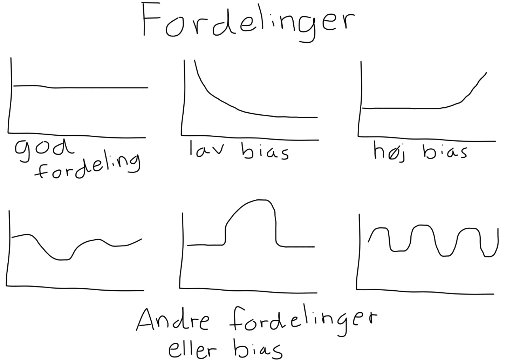

# Simuleringer

I dette kapitel, vil der redegøres for lidt baggrundsviden omkring datasimulering, og hvordan tilsyneladende tilfældige tal kan genereres ved hjælp af algoritmer. Derefter vil der ses på hvordan programmeringssproget R, kan udnyttes til at udføre disse simuleringer hurtigt og simpelt. 

Simuleringer er generering af estimater på mulige udfald, og på den måde en efterligning af virkeligheden. Formålet er derved at generere tilfældigt estimerede værdier ud fra en model, der simulerer virkeligheden, hvilket muliggør yderligere analyser.

En definition på simulering er;

>A situation or event that seems real but is not real, used especially in order to help people deal with such situations or events. - Cambridge Dictonary, [@CambridgeSimulation].

Ud fra definitionen, er formålet altså ved simuleringer at efterligne virkeligheden, så de analyser der gøres på baggrund af simuleringerne, kan bruges i virkeligheden når lignende situationer opstår.
Brancher hvor simuleringer er et yderst vigtigt redskab, er i motorsporten. I Formel 1 benytter holdene sig af simulatorer, hvor de genskaber bilerne og derved kan teste nye dele inden de producere dem i virkeligheden for at spare penge. Derved kan de analysere, hvilke forskellige dele der producerer mest _down-force_, uden at skulle teste dem i virkelig, [@MercedesF1].

## Pseudorandom number generator

__FIXME__ Mangler kilde

I dette afsnit introduceres begrebet _pseudorandom number generator_ (PRNG) og hvorledes den kan bringes i anvendelse i forbindelse med simuleringer. I de tilhørende underafsnit beskrives først en type af PRNG kaldet lineær kongruens generator, og dernæst en metode til at omdanne uniformt fordelte talt til standard normalfordelte tal kaldet Box-Muller-transformation. 

En computer fungerer ved, at den modtager et input, der bearbejdes af en algoritme, som derefter returnerer et output. Der findes ingen algoritmer, som er i stand til at generere faktisk tilfældige tal. Grunden til dette er, hvis der gives det samme input, til den samme algoritme, vil resultatet være det samme output som tidligere, fordi en computer fungerer på baggrund af matematik og derfor er deterministisk. Det er dog muligt ved hjælp af en beregningsmodel at skabe en illusion af ægte tilfældighed. Denne model kaldes _pseudorandom number generator_ (PRNG).

En PRNGs funktionalitet beskrives ved nedenstående karakteristika. 

1. Et input, kaldet seed, på baggrund af hvilket algoritmen beregner et pseudo-tilfældigt output. Herefter fortsætter algortimen rekursivt, hvor det forrige output anvendes som nyt input. 

2. Perioden, som beskriver hvor mange repetitioner algortimen gennemløber, før outputtet begynder at gentage sig selv. Jo kortere perioden er, des mere gennemskuelig vil algoritmen fremstå.

3. Fordeling af de tal værdier der generes. Som det ses på figuren nedenunder, kan fordelingen af de genererede tal være jævn, hvilket viser en ligelig fordeling af tallene. Ses der derimod et mønster eller tendens i fordelingen, vil algoritmen ikke være forventningsret, og alvendeligheden formindskes.  

```{r, out.width='75%', fig.align='center', fig.cap="PRNG fordelinger", echo = FALSE}
 
```

En af de tidligste algortimer til PRNG, _middle-square method_, blev udvilket af John von Neumann. Svagheden ved denne metode er, at dens periode oftest er ret kort og derfor hurtigt begynder at gentage den samme talsekvens, [@PRNGintro, s. 12-13]. I takt med udviklingen af de teknologiske hjælpemidler er der opstået mere effektive algortimer til PRNG. En af de mere kendte og hyppigt anvendte algoritmer er lineær kongruens generator, som gennemgåes i det følgnede afsnit.

### Lineær kongruens generator

Dette afsnit beskriver, hvorledes lineær kongruens generatorer, på baggrund af en arbitrær parameter, kan generere en sekvens af tilfældige tal, som kan være uniformt fordelte. Det følgende afsnit er primært baseret på kilden [@LCGinfo].

Lineær kongruens generator, på engelsk _linear congruential generator_ (LCG), er en af de mange PRNG generatorer. Denne algoritme er en af de ældste og nemmeste at implementere. LCG danner en sekvens af tal ved iteration, og kræver kun få parametre. Helt specifikt er algoritmen angivet ved

>```{definition}
> Lineær kongruens generator danner en talsekvens, $X = [X_0, X_1, \ldots, X_n]$, hvor $X_{i} = (a \cdot X_{i-1} + c) \mod m$.\
> Her er $a, c, m  \in \mathbb{Z}$, og $0 < m$, $0 < a < m$ og $0 \leq c < m$.
>```

Algoritmen fungerer således:
Der startes ved en værdi angivet med $X_0$, som bliver multipliceret med $a$ og tilvæksten $c$ lægges til. Derefter tages modulus, $m$, af værdien. Modulus er en operator der dividerer et tal med et andet tal og returnerer restværdien.

I figuren nedenfor kan ses tre eksempler på LCG i aktion. De to første eksempler har samme parametre, men forskellige startpunkter.

```{r, out.width='75%', fig.align='center', fig.cap=" 3 eksempler på LCG. [@lincongenvis]", echo = FALSE}
 knitr::include_graphics("images/LCG_eksempel.PNG")
```

I teorien er parameterne arbitrære, men i praksis bruges nogle værdier oftere end andre. Begrundelsen for dette er, at der findes "dårlige" værdier for parameterne, der vil returnere en tilsyneladende ikke-tilfældig sekvens af værdier. Et eksempel på dette er ved parameterne: $m = 64, a = 33$ og $c = 12$. Efter et antal iterationer vil der ses et mønster i værdierne, og det blotte øje vil altså kunne se at denne sekvens i virkeligheden ikke er helt tilfældig. Dette vil vises om lidt.

__Eksempel__

De følgende simuleringer er baseret på kilden [@LCGsimu], som også går mere i dybden med hvordan, der undersøges om ens parametre genererer tilsyneladende tilfældige værdier.

Først defineres en funktion for LCG algoritmen, som tager de nødvendige argumenter for algoritmen. Disse blev der redegjort for tidligere i afsnittet. Derudover angives også et argument, $n$, der fortæller hvor mange iterationer algoritmen skal foretage.

```{r}
lcg <- function(m, a, c, seed, n) {
  #M er modulus, a er faktoren, c er tilvæksten, seed er
  #startværdien og n er antal iterationer.
  
  r <- numeric(n) #Definerer en ny variabel r,
                  #som er den numeriske værdi af n.
  r[1] <- seed #Angiver startpunktet. 
  
  for (i in 1: (n-1)) {
  r[i + 1] <- (a * r[i] + c) %% m
  
}
 return(r)
}
```

Det følgende er et eksempel på en LCG sekvens med en periode på $16$. Perioden fortæller, hvor mange værdier generatoren returnerer inden den gentager sig selv.  

```{r}
lcg1 <- lcg(64, 33, 12, 57, 17)
lcg1
```

Plottes denne sekvens, vil det sse at værdierne ikke er tilfældige, da det er tydeligt se perioderne. Selv hvis antallet af gange LCG køres igennem ændrers, vil det tydelige mønster ikke ændre sig.

```{r}
lcg1_plot <- lcg(64, 33, 12, 57, 100)
plot(lcg1_plot, main = "Eksempel på en ikke tilfældig LCG sekvens", 
     xlab = "Indeks", ylab = "Sekvens værdier", type = "l")
```

Nedenfor vises et eksempel på hvordan LCG algortimen kan bruges til at lave en uniform fordeling i intervallet [0, 1].

```{r}
lcg2 <- lcg(86436, 1093, 0, 12, 1000)

hist((lcg2 + 0.05)/ 86436, main = "LCG Uniform fordeling", 
     xlab = "Sekvens værdier", ylab = "Frekvens")
```

Her kan det også nævnes, at hvis de værdier algoritmen returnerer plottes i et 2d-punktplot, vil der fremgå en tydeligere "tilfældig" fordeling, dog vil der stadig kunne ses et mønster.

```{r}
plot(lcg2, main = "2d plot af LCG sekvens", xlab = "Indeks", 
     ylab = "Sekvens værdier")
```


Afslutningsvist vil der vises et eksempel, hvor der returneres en sekvens der ser tilfældig ud.

```{r}
lcg3 <- lcg(86436, 1093, 18257, 12, 100)

plot(lcg3, main = "'Tilfældig' LCG Sekvens", xlab = "Indeks", 
     ylab = "Sekvens værdier", type = "l")
```

### Box-Muller-transformation

I dette afsnit beskrives Box-Muller-transformation, hvilket er en metode til at generere standard normalfordelte tal ud fra uniformt fordelte tal. Dette gøres for at belyse, hvordan en computer kan generere tilsyneladende tilfældige tal, der er normalfordelt. Afsnittet er skrevet med inspiration fra [@Box-Muller]. Metoden beskrives konkret i nedenstående sætning.

>```{theorem}
> Box-Muller-transformation
>
> Antag, at $U_1$ og $U_2$ er uafhængige stokastiske variabler, der begge er uniformt fordelt på intervallet $[0, 1]$. Lad $$Z_1 = \sqrt{-2 \mathrm{ln} U_1} \mathrm{cos}(2\pi U_2)~ \wedge~ Z_2 = \sqrt{-2 \mathrm{ln} U_1} \mathrm{sin}(2\pi U_2)$$. Så er $Z_1$ og $Z_2$ uafhængige stokastiske variabler, der er standard normalfordelte.
>```

__Eksempel__

I dette afsnit oprettes to normalfordelinger ved hjælp af Box-Muller-transformationen i R.

Først simuleres to populationer, ```U1``` og ```U2```, hvor $\mathrm{U1 \sim unif(0,1)}$ og $\mathrm{U2 \sim unif(0,1)}$, som er de to uniformt fordelte populationer, der genereres normalfordelinger ud fra.

```{r, echo = FALSE, message=FALSE}
set.seed(2000)
library(mosaic)
library(e1071)
```

```{r}
U1 <- runif(n = 100000, min = 0, max = 1)
U2 <- runif(n = 100000, min = 0, max = 1)
```

Disse to populationer benyttes nu til at oprette de to påstået standard normalfordelte populationer, ```Z1``` og ```Z2```.

```{r}
Z1 <- sqrt(-2*log(U1))*cos(2*pi*U2)
Z2 <- sqrt(-2*log(U1))*sin(2*pi*U2)
```

__Efterprøvning i R__

I det følgende afsnit efterprøves den forventede normalfordeling af Box-Muller-transformationen i R.

Det kan nu undersøges deskriptivt, hvilken fordeling ```Z1``` og ```Z2``` har.

Først oprettes et boksplot af de to populationer, der kan understøtte normalfordeling.

```{r}
boxplot(Z1, Z2, main = "Boksplot af Z1 og Z2")
```

Det ses på boksplottet, at der er en indikation på normalfordeling med henvisning til de fire krav et boksplot af en normalfordeling opfylder. De fire krav er:

1) Median og middelværdi er lig hinanden.

2) Øvre og nedre kvartil er lige langt fra midten.

3) Der er lige mange outliers over øvre kvartil som under nedre kvartil.

4) 0,7 % af observationerne ligger som outliers.

Punkterne 2 og 3 tjekkes ved at betragte boksplottet, hvor der ikke umiddelbart synes at være noget, der modbeviser en normalfordeling af ```Z1``` og ```Z2```.

For at tjekke punkt 1, beregnes median (```median```) og middelværdi (```mean```) i kodestykket nedenfor.

```{r}
mean_Z1 <- mean(Z1)
median_Z1 <- median(Z1)

mean_Z2 <- mean(Z2)
median_Z2 <- median(Z2)


```

Dette giver henholdsvis en middelværdi og median for ```Z1``` på $`r mean_Z1`$ og $`r median_Z1`$, samt for ```Z2```  på $`r mean_Z2`$ og $`r median_Z2`$. Disse resultater ligger meget tæt på hinanden, og den meget lave værdi stemmer overens med forventningen om, at ```Z1``` og ```Z2``` er standard normalfordelt.

For at tjekke punkt $4$, beregnes andelen af outliers i hvert boksplot i kodestykket nedenfor.

```{r}
OutVals1 <- boxplot(Z1, plot = FALSE)$out
outliers_Z1 <- length(OutVals1)

OutVals2 <- boxplot(Z2, plot = FALSE)$out
outliers_Z2 <- length(OutVals2)

outliers_andel_Z1 <- outliers_Z1/length(Z1)
outliers_andel_Z2 <- outliers_Z2/length(Z2)
```

Dette giver en andel af outliers i ```Z1``` på ```r outliers_andel_Z1``` og i ```Z2``` på ```r outliers_andel_Z2```. Dette svarer til cirka $0,7~ \%$ outliers i både ```Z1``` og ```Z2```, hvilket stemmer overens med punkt 4.

Der er altså ikke noget evidens imod, at ```Z1``` og ```Z2``` skulle være normalfordelt. Tværtimod underbygger beregningen af deres middelværdi, at de er _standard_ normalfordelte.

Hernest kigges der på histogrammerne for ```Z1``` og ```Z2```.

```{r}

par(mfrow = c(1,2))
hist(Z1, main = "Histogram for Z1", ylab = "Frekvens", prob = TRUE)
lines(density(Z1), col = "blue")

hist(Z2, main = "Histogram for Z2", ylab = "Frekvens", prob = TRUE)
lines(density(Z2), col = "blue")

```

Det ses på histogrammerne, at de tilnærmelsesvist er normalfordelte, samt at de har en middelværdi på $\approx 0$ og en standardafvigelse på $\approx 1$, og derved er  ```Z1``` og ```Z2``` standard normalfordelte.

Desuden er det også en konsekvens af Box-Muller-transformationerne, at ```Z1``` og ```Z2``` er uafhængige. Dette undersøges ved hjælp af nedenstående graf.

__FIXME:__ (Husk at indsætte figuren inden aflevering! :-))
<!--```{r}
plot(Z2 ~ Z1, main = "Graf for uafhængighed mellem Z1 og Z2", 
     col = rgb(red = 0, green = 0, blue = 0, alpha = 0.25), 
     pch = 1, cex = 0.5)

```-->

Udover at eftervise uafhængigheden af ```Z1``` og ```Z2``` grafisk, kan det også undersøges ved hjælp af funktionen ```cor``` i R, som giver en værdi for korrelationen af de to talsekvenser.
Korrelationen af to variabler udregnes ved formlen 

$$
cor(X, Y) = \frac{cov(X, Y)}{sd(X) \cdot sd(Y)}  
$$
Hvor $cov$ angiver kovariansen og $sd$ angiver standardafvigelsen.

Korrelation fortæller, hvor stor en lineær sammenhæng der er mellem to variabler. Denne værdi ligger i intervallet $[-1, 1]$, hvor $-1$ påviser en perfekt negativ lineær sammenhæng, $1$ påviser en perfekt positiv lineær sammenhæng, og $0$ viser, at der ingen lineær sammenhæng er. 

```{r}
cor(Z1, Z2)
```

Et resultat på afrundet $-0.00048$, hvilket næsten er 0, viser altså også at der ingen lineær korrelation er mellem ```Z1``` og ```Z2```, hvilket giver en indiktion for, at de er uafhængige.

## Simulering i R {#pop-sim}

I dette afsnit gives eksempler på, hvorledes der kan udføres simuleringer af forskellige fordelinger, således disse fordelinger kan anvendes til statistisk inferens. Afsnittet er primært baseret på kilden [@Rsimulation].

Simuleringer i R udføres ved at estimere udfald fra en fordeling, hvor der bliver generet pseudo-tilfældige tal. Disse generede tal forekommer at være tilfældige, men er det reelt set ikke, [@PRNG]. Tallene er genereret ud fra et _seed_, som i R bestemmes ved ```set.seed("værdi")```. Dette _seed_ vil nu angives, så de følgende genereret tal vil være ens, ved nye gennemkørsler.

```{r}
set.seed(29)
```

I dataanalysen vil de viste fordelinger, bruges som populationer, og stikprøver udtages så ved hjælp af forskellige funktioner. Ideén med denne fremgangsmåde er, at man derved udtrækker stikprøver, ud fra den teoretiske uendelige fordeling. 

Nogle af de fordelinger, der kan simuleres i R, er blandt andet en normalfordeling, binomialfordeling, uniform fordeling eller en betafordeling. Alle disse fordelinger har forskellige karateristika, som påvirker hvilke værdier de kan antage. Der vil nu vises eksempler på, hvordan disse fordelinger simuleres i R, og hvordan resultatet vil se ud. 

### Normalfordeling

I R simuleres en normalfordeling ved funktionen ```rnorm```, hvor "r" står for tilfældigt genererede tal, og "norm" for en normalfordeling. Fordelingen på figur \@ref(fig:normal) bliver genereret ud fra en middelværdi på $0$ og en standardafvigelse på $1$. Sådan en normalfordeling kaldes for en standard normalfordeling eller Z-fordeling.

```{r normal, echo = FALSE, fig.cap = "En normalfordeling med størrelsen n = 1000, en middelværdi på 0 og en standardafvigelse på 1. Med disse værdier kaldes den også for en standard normalfordeling eller Z-fordeling"}
normalfordeling <- rnorm(n = 1000, mean = 0, sd = 1)
hist(normalfordeling, main = "", ylab = "Antal observationer", xlab = "", prob = TRUE)
lines(density(normalfordeling))
```

### Uniform fordeling

En uniform fordeling er genereret ud fra en maksimum- og minimumværdi, som der skal genereres et givent antal værdier indenfor. Alle disse værdier har lige stor sandsynlighed for at blive genereret. Jo større $n$ er, des mere uniformt bliver histogrammet.

```{r}
uniformfordeling <- runif(n = 100000, min = 1, max = 2)
```

```{r echo = FALSE, fig.cap = "En uniform fordeling med størrelsen n = 100.000, hvor alle tal har lige stor sandsynlighed for at optræde i intervallet [0 , 1]."}
hist(uniformfordeling, main = "", xlab = "", ylab = "Antal observationer", prob = TRUE)
lines(density(uniformfordeling))
```

### Skæv fordeling

En skæv fordeling er kendetegnet ved, at størstedelen af observationerne er samlet omkring visse værdier, mens de resterende observationer fordeler sig ud til kun én af siderne. De resterende observationer kaldes for "halen" af fordelingen, og alt efter retningen af dem, kaldes den skæve fordeling for "venstreskæv" elller "højreskæv". 

### Binomialfordeling

En binomialfordeling bliver genreret ud for sandsynligheder. I den binomiale fordeling gives en _size_ som er antallet af eksperimenter, samt en sandsynlighed for succes, angivet med _prob_.

```{r}
Binomialfordeling <- rbinom(n = 100, size = 1, prob = 0.5)
```

```{r echo = FALSE, fig.cap = "En binomialfordeling med størrelsen n = 100, size = 1 og en sandsynlighed for succes på prob = 0.5."}
hist(Binomialfordeling, xaxt = 'n', xlab = "", ylab = "Antal observationer", main = "")
axis(side=1, at=c(0,1), labels=c("Fiasko = 0","Succes = 1"))
```


En egenskab ved binomialfordelinger er, at jo højere $n$ er, des tættere vil middelværdien af stikprøven være på sandsynligheden for succes. I dette tilfælde med en størrelse på $n = 100$, er middelværdien ```r mean(Binomialfordeling)```. 

### Betafordeling

En skæv fordeling kan være en betafordeling, $\text{Beta}(\alpha, \beta)$, hvor $\alpha-1$ angiver andelen af succeser og $\beta-1$ angiver andelen af fiaskoer. Betafordelingen er tilnærmelsesvis normaltfordelt, hvis $\alpha$ og $\beta$ begge er tilpas store og omtrent ens, [@TDSBeta].

En venstreskæv og en højreskæv betafordeling vil nu simuleres, hvor $\alpha = 8$ og $\beta = 2$ for den venstreskæve, mens $\alpha = 2$ og $\beta = 8$ for den højreskæve. 

```{r}
venstre <- rbeta(n = 1000, shape1 = 8, shape2 = 2) 
hoejre <- rbeta(n = 1000, shape1 = 2, shape2 = 8) 
```

```{r echo = FALSE, fig.cap = "To betafordelinger hvor stikprøvestørrelse n = 1000, hvor (a) alpha = 8 og beta = 2, og (b) har alpha = 2 og beta = 8."}
par(mfrow=c(1,2))
hist(venstre, main = "(a) Venstreskæv fordeling", ylab = "", xlab = "", xlim = c(0,1), ylim = c(0,4), prob = TRUE)
lines(density(venstre))
hist(hoejre, main = "(b) Højreskæv fordeling", ylab = "", xlab = "", xlim = c(0,1), ylim = c(0,4), prob = TRUE)
lines(density(hoejre))
```


### Gammafordeling

Er også en skæv fordeling, som betafordelingen er det. Funktionalitet af gammafordelingen er at forudsige ventetiden til det $\alpha\text{-}th$ __FIXME__ (eller skal det skrive $\alpha'th$) begivenhed. Tæthedsfunktionen for gammafordelingen, er beskrevet med to forskellige parametersæt, henholdsvis $(k,~\theta)$ og $(\alpha,~\beta)$. I denne rapport vil der fremefter bliver anvendt  parameterne $(\alpha,~\beta)$, med tilhørende tæthedsfunktion. $\frac{\beta^{\alpha}}{\Gamma(\alpha)}x^{\alpha-1}e^{-\beta x}$, hvor $\alpha > 0$ er "shape", $\beta > 0$ er "rate" og $x \in ( 0, \infty)$. Påtrods af forskellige tæthedsfunktioner for de to parametersæt, generere de den samme fordeling [@Gammadist].


```{r echo = FALSE, fig.cap = "Tre gammafordelinger hvor stikprøvestørrelse n = 100,000, alfa på hhv. 1, 5 og 10 og beta = 1"} 
library(ggplot2)
library(dplyr)

dfGamma = data.frame(alfa_1 = rgamma(n = 100000, 1, 1),
          alfa_5 = rgamma(n = 100000, 5, 1),
          alfa_10 = rgamma(n = 100000, 10, 1))

dfGamma = stack(dfGamma)

p <- ggplot(dfGamma, aes(x = values)) +
  stat_density(aes(group = ind, color = ind),position="identity",geom="line")

plot(p)
```

### Replicate

I nogle statistike metoder er det nødvendigt at arbejde med flere stikprøver end kun én enkelt. Med funktionen ```replicate``` i R, kan der genereres adskillige nye stikprøver ud fra den oprindelige. Processen med _replicate_ vil nu vises. Først ses en stikprøve med tre observationer.

```{r echo = FALSE}
stik <- rnorm(3, 0 ,1) #Den oprindelige stikprøve
stik_matrix <- matrix(stik, nrow = 3)
colnames(stik_matrix) <- c("Oprindelig stikprøve")
rownames(stik_matrix) <- c("Observation 1", "Observation 2", "Observation 3")
stik_matrix
```

_Replicate_-funktionen vil nu bruges. I alt replikeres der fem gange, hvilket betyder, at der bliver oprettet fem nye stikprøver. I forbindelse med denne process udnyttes funktionen ```sample```, som er den funktion der _resampler_, enten med eller uden tilbagelægning fra stikprøven. I dette eksempel bliver der brugt tilbagelægning. Fra den oprindelige stikprøve udtrækkes der en observation, som indsættes i den nye stikprøve. Observationer bliver derefter lagt tilbage i den oprindelige stikprøve, hvilket betyder, at der er en sandsynlighed for at se den samme observation flere gange. Grunden til dette er, at stikprøven anses for at være repræsentativ for population, og to af den samme observation derfor ikke er utænkelig at observere.

```{r}
ny_stik <- replicate(5, { #Der replikeres 5 gange
  sample(stik, size = 3, replace = TRUE)
})
rep
```

Nu er der oprettet fem helt nye repræsentative stikprøver udfra den oprindelige. Denne metode og dens anvendelser vil der kigges nærmere på kapitel \@ref(boot-afsnit). 
