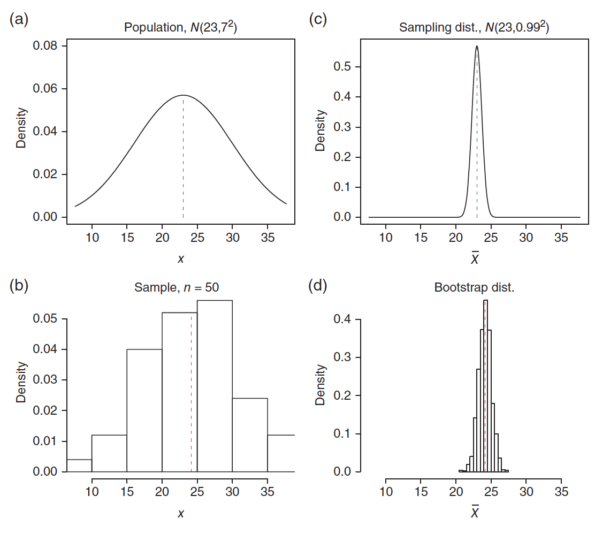

```{r, echo=FALSE, message=FALSE}
library(mosaic)
set.seed(29)
```
# Bootstrap {#boot-afsnit}

I dette kapitel vil den teoretiske del af bootstrap blive beskrevet og hvordan der udtages bootstrap-stikprøver. Herefter vil der blive undersøgt, hvordan bootstrap kan anvendes i praksis til at udregne standardfejl for en estimator, hvordan hypotesetest udføres ved hjælp af bootstrap og til at angive konfidensintervaller. Til hver anvendelse vil der også blive givet et eksempel på metoden.

## Ikke-parametrisk bootstrap

Der findes forskellige bootstrap-metoder, som varierer på forskellige punkter. Valget af bootstrap-metode afhænger af den individuelle situation, hvor der skal udføres statistisk inferens. Der gøres opmærksom på, at i den resterende del af rapporten, vil ordet bootstrap henvise til den ikke-parametriske bootstrap-metode. Ikke-parametrisk bootstrap, er når der ikke sættes specifikke antagelser eller en præcis model for populationen, når undersøgelsen udføres. Derimod antages det, at en stikprøve er repræsentativ for hele populationen, [@nonparaboot, side 3].

Bootstrap er en resampling-metode, der bruges til at generere yderligere datasæt ud fra den givne stikprøve, hvor målet er at udføre statistisk inferens for en valgt teststørrelse. For eksempel kan bootstrap give et indblik i tendenser for teststørrelsen, såsom standardfejlen og forventningsrethed, eller udregne konfidensintervaller. Der gøres opmærksom på, at bootstrap ikke kan bruges til at få et bedre estimat for parameteren, da bootstrap-fordelingen er centreret omkring stikprøvens estimat, se Figur \@ref(fig:fig-boot-fordeling), for eksempel middelværdien $\hat {\mu}$, og ikke populationens middelværdi, $\mu$, [@BootvsJack s. 114].

```{r fig-boot-fordeling, out.width='90%', fig.align='center', fig.cap="(a) Populationens fordeling,  N(23, 49). (b) Fordelingen på en stikprøve af størrelsen 50. (c) Den teoretiske fordeling af stikprøvens middelværdi. (d) Fordelingen af bootstrap-stikprøvernes middelværdi. De stiplede linjer representerer middelværdien, [@MathStat, side 108].", echo = FALSE}
par(mfrow=c(2,2))

norm_pop <- rnorm(n = 500000, mean = 23, sd = 7^2)
plot(density(norm_pop), xlim = c(-150, 200), main = "(a)", xlab = "", ylab ="", bty = "n")
abline(v = mean(norm_pop), lty = 3)

norm_stik <- rnorm(n = 50, mean = 23, sd = 7^2)
hist(norm_stik, xlim = c(-150, 200), main = "(b)", xlab = "", ylab ="")
abline(v = mean(norm_stik), lty = 3)

stik_fordeling <- replicate(10000, mean(rnorm(n = 50, mean = 23, sd = 7^2)))
plot(density(stik_fordeling), xlim = c(-150, 200), main = "(c)", xlab = "", ylab ="", bty = "n")
abline(v = mean(stik_fordeling), lty = 3)

boot_fordeling <- replicate(10000, mean(sample(norm_stik, replace = TRUE, size = 50)))
hist(boot_fordeling, xlim = c(-150, 200), main = "(d)", xlab = "", ylab ="")
abline(v = mean(boot_fordeling), lty = 3)

par(mfrow=c(1,1))
```


<!-- ```{r, out.width='75%', fig.align='center', fig.cap="(a) Populationsfordelingen, N(23, 49). (b) Fordelingen på en stikprøve af størrelsen 50. (c) Den teoretiske fordeling af stikprøvefordelingen bar{X}, N(23, 49/50). (d) Bootstrap fordelingen baseret på den stikprøve. De stiplede linjer representerer middelværdien [@MathStat, side 108]", echo = FALSE} -->
<!--  -->
<!-- ``` -->


Hver bootstrap-stikprøve har størrelsen $n$, altså den samme størrelse som stikprøven. Bootstrap opererer med tilbagelægning, så der er en sandsynlighed for, at et givent datapunkt bliver udtaget mere end en gang. Samtidig er der en sandsynlighed for, at et datapunkt slet ikke bliver udvalgt. Det er relevant at undersøge, hvor mange af de oprindelige observationer, som i gennemsnit medtages i nye bootstrap-stikprøver, og ligeledes, hvor mange, som udelades.

Sandsynligheden for, at en specifik observation ikke udtages fra de oprindelige $n$ observationer, er $1-1/n$, og sandsynligheden for, at denne observation ikke udtages $n$ gange er $(1-1/n)^n$. Når stikprøvestørrelsen, $n$, går mod uendeligt gælder, at $(1-1/n)^n  = 1/e \approx 0.368$. Derfor vil en bootstrap-stikprøve af tilpas stor størrelse indeholde $\approx 63.2\%$ observationer fra den oprindelige stikprøve, og udelade $\approx 36.8\%$, [@SAS].

I alt bliver der genereret $B$ bootstrap-stikprøver, som der hver især udføres statistisk inferens på. Med den computerkraft der er tilgængelig i dag, anbefales der af kilden, [@BootYouTube1], mindst $10,000$ resamples, derved $B \geq 10,000$, for at få et nøjagtigt estimat. Grunden til, at der ikke genereres et endnu større antal bootstrap-stikprøver end de $10,000$ er, at bootstrap-stikprøven generes ud fra den obseverede data. Et større $B$ vil derfor ikke medføre yderligere information om populationen, men vil dog medvirke til et mere præcist estimat, [@BootYouTube1, 10:20].

Fordelen ved bootstrap er, at selvom der kun er én tilgængelig stikprøve fra den underliggende population, er der stadig mulighed for at estimere stikprøvefordelingen, uden at der kræves yderligere stikprøver fra populatonen. Dette skyldes netop antagelsen om, at stikprøven skal være repræsentativ for populationen.

```{r, figur-Bootstrap-illustration, out.width='75%', fig.align='center', fig.cap = "Her er illustreret forskellen mellem at finde den teoretiske stikprøvefordeling ved hjælp af mange stikprøver fra populationen (orange), og måden hvorpå stikprøvefordelingen kan findes ved hjælp af kun én stikprøve, der udføres bootstrap på (grøn).", echo = FALSE}
knitr::include_graphics('images/normalvboot.PNG')
```

Der er to hovedårsager til at benytte bootstrap, som beskrevet i [@BootYouTube1]. For det første, hvis stikprøven ikke er tilpas stor, og stikprøvefordelingen derfor heller ikke kan antages at være normalfordelt. For det andet, hvis metoden til at beregne teststørrelsens standardfejl er teoretisk avanceret. Eksempelvis er standardfejlen for middelværdien nem at løse, $\hat{\text{se}}(\hat{\mu}) = \frac{S}{\sqrt{n}}$, mens det ikke er tilfældet, hvis det i stedet er afstanden mellem to percentiler, der estimeres.
