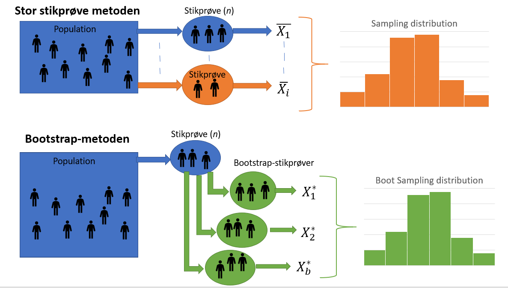

```{r, echo=FALSE, message=FALSE}
library(mosaic)
```
## Bootstrap

FIXME: Evt se på figuren i file:///C:/Users/magnu/Desktop/DV/B%C3%B8ger/Mathematical%20Statistics%20with%20Resampling%20and%20R.pdf side 108 for at vise fordelinger

__Indledning__

I det følgende afsnit vil den teoretiske del af en resampling metode, kaldet bootstrap, blive beskrevet. Senere vil der blive undersøgt hvordan bootstrap kan bruges praktisk.
Der findes en del forskellige bootstrap-metoder, som varierer på forskellige punkter. Afhængigt af den individuelle situation, hvor der skal udføres statistisk inferens, vil man vælge en af disse metoder.
Der gøres opmærksom på, at i den resterende del af rapporten, vil ordet bootstrap henvise til den ikke-parametriske bootstrap-metode. Ikke-parametriske bootstrap, er når der ikke sættes specifikke antagelser eller en præcis model for population, når undersøgelsen udføres.(FIXME: Kilde file:///C:/Users/magnu/Downloads/Berrar_EBCB_Bootstrapping_preprint.pdf side 3)

__Hvad er bootstrap?__

Bootstrap en resampling-metode, der bruges til at generere yderligere datasæt ud fra den givne stikprøve, hvor målet er at udføre statistisk inferens for den valgte estimator. For eksempel kan bootstrap bruges til at give et indblik i tendenser for estimatoren, såsom standardfejlen og forventningsrethed eller den kan bruges til at udregne konfidensintervaller. Der gøres opmærksom på at, bootstrap ikke bruges til at få et bedre parameter estimat, da bootstrap-fordelingen er centreret omkring stikprøvens estimat, f.eks. middelværdien $\bar {y}$, og ikke populationens middelværdi, $\mu$ [@BootvsJack s. 114].

Det er vigtigt for nøjagtigheden af bootstrap, at stikprøven har en tilpas stor størrelse. (FIXME: Er det? Mente vi så at en af grundene til at bruge bootstrap er hvis ens stikprøve er lille ... YouTube).

Bootstrap opererer med tilbagelægning, så der er en sandsynlighed for at et givent datapunkt bliver udtaget mere end en gang, samt er der en sandsynlighed for at et datapunkt slet ikke bliver udvalgt. Hver bootstrap-stikprøve har størrelsen $n$, altså den samme størrelse som stikprøven. I alt bliver der genereret $b$ antal bootstrap-stikprøver, som der hver især udføres statistisk inferens på. Ud fra disse estimater, kan der estimeres en stikprøvefordeling, hvor der udfra kan udføres yderligere statistisk inferens. (FIXME: Kilde på tilbagelægning? måske [@TDSBootstrap])

Fordelen ved bootstrap er at, selvom man kun har en stikprøve fra den underliggende population, er der stadig mulighed for at estimere stikprøvefordelingen, uden at der kræves yderligere stikprøver fra populatonen. (Illustrer)

```{r, figur-Bootstrap, out.width='75%', fig.align='center', fig.cap = "Her er illustreret hvordan, der teoretisk set kan udregnes en stikprøvefordeling, ved mange stikprøve udtræk fra population (Mange stikprøver). Kan dette ikke lade sig gøre, kan bootstrap udnyttes, til at finde et estimat af stikprøvefordelingen.", echo = FALSE}

```


__Antal resamples__

Standarden for størrelsen af $b$ har typisk været mindst 1000, men nu til dags, med den computerkraft der findes, er anbefalingen 10,000 gange. Det kan undres, at der ikke vælges at genere et endnu større antal bootstrap-stikprøver end de 10,000. Grunden til dette er, at da bootstrap-stikprøven generes ud fra den obseveret data med $n$ størrelse, vil der ikke skaffes yderlige information fra stikprøven med et større $b$. Det eneste der vil opnås ved et højere $b$, er et lidt bedre estimat. (FIXME: Kilde? Er fra 10:20 https://www.youtube.com/watch?v=O_Fj4q8lgmc&list=PLqzoL9-eJTNDp_bWyWBdw2ioA43B3dBrl&index=2&t=0s)

__Andel af oprindelige observationer__

Som nævnt, udnytter bootstrap-metoden tilbagelægning, og det er derfor vigtigt at have en viden om, hvor mange af de oprindelige observationer, som i gennemsnit medtages i nye bootstrap-stikprøver, og ligeledes, hvor mange, som udelades.

FIXME Læs lige igennem
Sandsynligheden for, at en specifik observation ikke udtages fra de oprindelige _n_ observationer er $1-1/n$, og sandsynligheden for, at denne observation ikke udtages _n_ gange er $(1-1/n)^n$. Når stikprøvestørrelsen, $n$, går mod uendeligt gælder, at $(1-1/n)^n  = 1/e \approx 0.368$. Derfor vil en bootstrap-stikprøve af tilpas stor størrelse indeholde $\approx 63.2\%$ observationer fra den oprindelige stikprøve, og udelade $\approx 36.8\%$. [@SAS]


__Ikke færdigt__


```{r}
set.seed(1)
norm_pop <- rnorm(n = 100, mean = 23, sd = 7)
hist(norm_pop, prob = TRUE)
lines(density(norm_pop))

norm_stik <- 
```

<!-- GAMMELT AFSNIT -->
<!-- __FIXME:__ Mangler at skrive om parametrisk bootstrap + Bootstrap-stikprøve følger ikke populationens fordeling -->

<!-- __FIXME:__ Mere teoretiske ting - bootstrap-stikprøvens fordeling samt standardfejl, hypotesetest og konfidensinterval vha. bootstrap -->

<!-- Det følgende afsnit er baseret på [@TDSBootstrap]. -->

<!-- Bootstrap er en resampling-metode, til at generere yderligere datasæt ud fra stikprøven, hvor målet er at udføre statistisk inferens for den valgte estimator. Det kan give indblik i tendenser, såsom standardfejlen, forventingsrethed eller konfidensintervaller [@BootvsJack s. 114]. Det er her vigtigt for nøjagtigheden af bootstrap, at stikprøven har en tilpas stor størrelse. -->

<!-- Når der genereres nye datasæt, udtages der et tilfældigt datapunkt, som indsættes i et nyt datasæt. Det udtagede datapunkt, føres tilbage i det oprindelige datasæt (kaldet tilbagelægning), og processen gentages indtil det nye datasæt har samme størrelse som stikprøven. Hvert datapunkt har lige stor sandsynlighed for at blive udvalgt, $\frac{1}{n}$, hvor $n$ er antal observationer. Hele denne process gentages $b$ antal gange, hvor der tages en _resample_ af stikprøven, der udføres inferens på. -->

<!-- Fremgangsmåden for bootstrapping, er således: -->
<!-- Indledningsvis udtages en stikprøve fra en population, hvorfra der trækkes yderligere stikprøver fra. Disse kaldes bootstrap-stikprøver. På hver bootstrap-stikprøve udføres statistisk inferens. -->
<!-- Efter $b$ gentagelser, kan der eksempelvis udregnes standardfejl og et tilhørende konfidensinterval for stikprøven. -->

<!-- ### Andel af oprindelige observationer -->

<!-- Da bootstrap-stikprøver fungerer med tilbagelægning, vil der i forbindelse med generering af nye stikprøver, forekomme gentagelser af observationer. Dette vil ligeledes betyde, at der vil være observationer som udelades. Derfor er det vigtigt at have en viden om, hvor mange af de oprindelige observationer, som i gennemsnit medtages i nye bootstrap-stikprøver, og ligeledes, hvor mange, som udelades. -->

<!-- Sandsynligheden for, at en specifik observation ikke udtages fra de oprindelige _n_ observationer er $1-1/n$, og sandsynligheden for, at denne observation ikke udtages _n_ gange er $(1-1/n)^n$. Når stikprøvestørrelsen, $n$, går mod uendeligt gælder, at $(1-1/n)^n  = 1/e \approx 0.368$. Derfor vil en bootstrap-stikprøve af tilpas stor størrelse indeholde $\approx 63.2\%$ observationer fra den oprindelige stikprøve, og udelade $\approx 36.8\%$. [@SAS] -->
