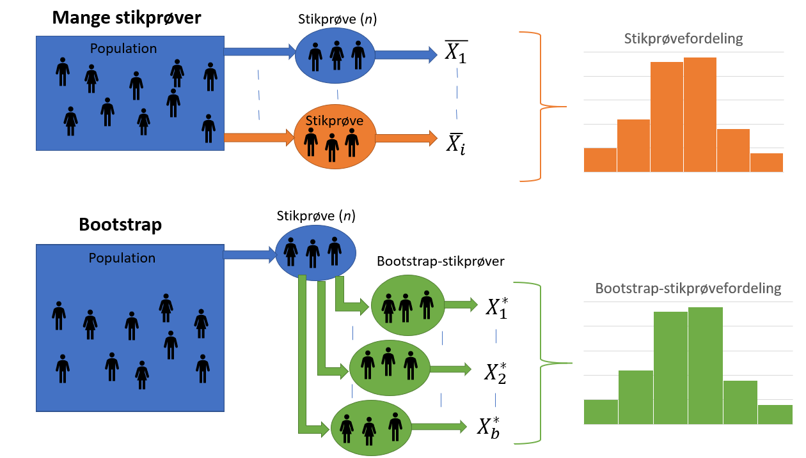

```{r, echo=FALSE, message=FALSE}
library(mosaic)
```
## Bootstrap

FIXME: Evt se på figuren i file:///C:/Users/magnu/Desktop/DV/B%C3%B8ger/Mathematical%20Statistics%20with%20Resampling%20and%20R.pdf side 108 for at vise fordelinger


I det følgende afsnit vil den teoretiske del af en resampling-metode, kaldet bootstrap, blive beskrevet. Senere vil det blive undersøgt, hvordan bootstrap kan bruges praktisk.

Der findes forskellige bootstrap-metoder, som varierer på forskellige punkter. Valget af bootstrap-metode afhænger af den individuelle situation, hvor der skal udføres statistisk inferens. Der gøres opmærksom på, at i den resterende del af rapporten, vil ordet bootstrap henvise til den ikke-parametriske bootstrap-metode. Ikke-parametrisk bootstrap, er når der ikke sættes specifikke antagelser eller en præcis model for populationen, når undersøgelsen udføres. Derimod antages det, at en stikprøve er repræsentativ for hele populationen. (FIXME: Kilde file:///C:/Users/magnu/Downloads/Berrar_EBCB_Bootstrapping_preprint.pdf side 3)

Bootstrap er en resampling-metode, der bruges til at generere yderligere datasæt ud fra den givne stikprøve, hvor målet er at udføre statistisk inferens for en valgt teststørrelse. For eksempel kan bootstrap give et indblik i tendenser for teststørrelsen, såsom standardfejlen og forventningsrethed, eller udregne konfidensintervaller. Der gøres opmærksom på, at bootstrap ikke kan bruges til at få et bedre estimat for parameteren, da bootstrap-fordelingen er centreret omkring stikprøvens estimat, for eksempel middelværdien $\hat {\mu}$, og ikke populationens middelværdi, $\mu$ [@BootvsJack s. 114].

Hver bootstrap-stikprøve har størrelsen $n$, altså den samme størrelse som stikprøven. Bootstrap opererer med tilbagelægning, så der er en sandsynlighed for, at et givent datapunkt bliver udtaget mere end en gang. Samtidig er der en sandsynlighed for, at et datapunkt slet ikke bliver udvalgt. Det er relevant at undersøge, hvor mange af de oprindelige observationer, som i gennemsnit medtages i nye bootstrap-stikprøver, og ligeledes, hvor mange, som udelades.

Sandsynligheden for, at en specifik observation ikke udtages fra de oprindelige $n$ observationer, er $1-1/n$, og sandsynligheden for, at denne observation ikke udtages $n$ gange er $(1-1/n)^n$. Når stikprøvestørrelsen, $n$, går mod uendeligt gælder, at $(1-1/n)^n  = 1/e \approx 0.368$. Derfor vil en bootstrap-stikprøve af tilpas stor størrelse indeholde $\approx 63.2\%$ observationer fra den oprindelige stikprøve, og udelade $\approx 36.8\%$. [@SAS] 

I alt bliver der genereret $B$ bootstrap-stikprøver, som der hver især udføres statistisk inferens på. Med den computerkraft der er tilgængelig i dag, anbefales der af kilden, [@BootYouTube1], mindst $10,000$ resamples, derved $B \geq 10,000$, for at få et nøjagtigt estimat. Grunden til, at der ikke genereres et endnu større antal bootstrap-stikprøver end de $10,000$ er, at bootstrap-stikprøven generes ud fra den obseverede data. Et større $B$ vil derfor ikke medføre yderligere information om populationen, men vil dog medvirke til et mere præcist estimat. [@BootYouTube1, 10:20] 

Fordelen ved bootstrap er, at selvom der kun er én tilgængelig stikprøve fra den underliggende population, er der stadig mulighed for at estimere stikprøvefordelingen, uden at der kræves yderligere stikprøver fra populatonen. Dette skyldes netop antagelsen om, at stikprøven skal være repræsentativ for populationen. 

```{r, figur-Bootstrap-illustration, out.width='75%', fig.align='center', fig.cap = "Her er illustreret forskellen mellem at finde den teoretiske stikprøvefordeling ved hjælp af mange stikprøver fra populationen (orange), og måden hvorpå stikprøvefordelingen kan findes ved hjælp af kun én stikprøve, der udføres bootstrap på (grøn).", echo = FALSE}

```
__FIXME__ Formler skal kigges igennem, om der er overensstemmelse.

Der er to hovedårsager til at benytte bootstrap, som beskrevet i [@BootYouTube1]. For det første, hvis stikprøven ikke er stor, og stikprøvefordelingen derfor heller ikke kan antages at være normalfordelt. For det andet, hvis metoden til at beregne teststørrelsens standardfejl er teoretisk avanceret. Eksempelvis er standardfejlen for middelværdien nem at løse, $\hat{\text{se}}(\hat{\mu}) = \frac{S}{\sqrt{n}}$, mens det ikke er tilfældet, hvis det i stedet er afstanden mellem to percentiler, der estimeres.

## Bootstrap-standardfejl 

Der vil i dette afsnit beskrives hvordan standardfejl af en bootstrap-stikprøve udregnes. I det efterfølgende afsnit vil standardfejlen inddrages i beregningen af konfidensintervallet for en bootstrap-stikprøve. 
Det følgende afsnit er primært skrevet på baggrund af [@TDSBootstrap].

Standardafvigelsen for en estimator beskrives som estimatorens standardfejl. Standardfejlen er et udtryk for, hvor stor en afvigelse der er fra populationens parameter til stikprøvens estimat. Jo mindre standardfejlen er, desto mindre er afvigelsen mellem estimatet og parameteren. Som udgangspunkt vil en stikprøves estimat aldrig være lig populationens parameter, fordi der ved udtagning af en stikprøve, i hvert tilfælde vil være variabilitet. Et mål for denne variabilitet er standardfejlen.

Som eksempel vil standardfejlen for estimatet af middelværdien, $\hat{\mu}$, være $\text{se}(\hat{\mu}) = \frac{\sigma}{\sqrt{n}}$.

Når der arbejdes med data udover det teoretiske, vil standardafvigelsen for populationen, $\sigma$, altid være ukendt. Derfor bruges stikprøvens estimat for standardafvigelsen, $S$ til at beregne den estimerede standardfejl, $\hat{\text{se}}$. 

Som eksempel vil den estimerede standardfejl for estimatet af middelværdien, $\hat{\mu}$, være  $\hat{\text{se}}(\hat{\mu}) = \frac{S}{\sqrt{n}}$, hvor $S = \sum_{i=1}^{n} \frac{(x_i - \hat{\mu})^2}{n - 1}$ er stikprøvens standardafvigelse for middelværdien, og $n$ er størrelsen på stikprøven.

Såfremt en estimator er normalfordelt eller tilnærmelsesvist er normalfordelt, kan det forventes, at et estimat vil være mindre end én standardfejl fra det forventede i $68\%$ af tilfældene og mindre end to standardfejl fra i $95\%$ af tilfældene. 

Dog er dette ikke altid ligetil i virkeligheden, oftest er der ikke tilstrækkelig informationer om populationen eller fordeligen af denne. Samtidig kræver det, at der er nogle specifikke krav som er opfyldt. Disse problemer kan undgås ved at benytte bootstrap til at estimere standardfejlen, givet ved nedstående formel.

$$se(\hat{\theta}) = \sqrt{\frac{1}{B-1}\sum_{b=1}^{B}(\hat{\theta_b^*} - \bar{\theta} )^2}$$

Hvor $\hat{\theta}$ er stikprøvens estimat for den ønskede parameter, $B$ er antal bootstrap-stikprøver, $\hat\theta_b^*$ er estimatet for den $b$'te bootstrap-stikprøve og $\bar{\theta} = (\frac{1}{B}) \sum_{b=1}^{B}\hat{\theta_b^*}$. [@BootMiracle]

__FIXME__ overgang til KI
Anvendelse af standardfejl i forbindelse med bootstrap-stikprøver...

