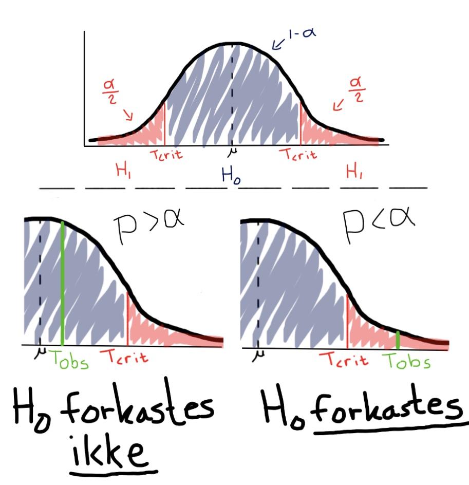

--- 
title: "P2 - Simulering af Data"
author: "Gruppe B2-19"
date: "`r Sys.Date()`"
site: bookdown::bookdown_site
output: bookdown::gitbook
documentclass: book
bibliography: [book.bib, packages.bib]
biblio-style: apalike
link-citations: yes
github-repo: rstudio/bookdown-demo
#description: "This is a minimal example of using the bookdown package to write a book. The output format for this example is bookdown::gitbook."
---

# Introduktion

__FIXME__ Husk link til Github.

Her vil vi gerne introducere rapporten

## Forord

## Abstract/Synopsis

## Indledning

## Anvendte pakker


<!--chapter:end:index.Rmd-->

# Problemanalyse

FIXME: Evt. emner: Fortæl om statistik. Fortæl om “almindelig” t-test og dens krav. Se, at resultater ikke giver mening, hvis krav ikke er opfyldt. 


## Statistik og historien bag

Ordet _statistik_ stammer tilbage fra det latinske _statisticum collegium_ ("statsrådgiver") og det italienske _statista_ ("statsmand" eller "politiker"), [@Orddef]. At statistik netop stammer derfra, giver god mening, under anskueelse af betydningen af disse to ord og den tidlige anvendelse af statistik. I takt med udviklingen af suverænitetsstaterne, steg behovet for at registrere befolkningen og dennes tilhørselsforhold. Derfor anvendte statsrådgivere og statsmænd statistik til at beskrive staten, særligt demografien. Senerere blev dette udvidet til at indsamle flere informationer, og ligeledes at analysere og fortolke disse ved hjælp af statistik.

<!-- Selve ordet statistik fandt sin vej til Danmark i 1749, via den tyske statistiker Gottfried Achenwall, som var den første, der anvendte ordet _statistik_ til at beskrive sine studier indenfor netop dette emne. [@Orddef] -->

Udgangspunktet for statistik kommer fra sandsynlighedsregning og læren derfra. Ligesom i sandsynlighedsregning arbejdes der i statistikken med udfald og tilfældigheder, men overordnet beskæftiger statistikken sig med analyse af indsamlet data.

<!-- Statistik blev i begyndelsen anvendt som en videnskablig metode til behandling af numerisk data. Særligt blev det anvendt som en metode til grafisk fremstilling af data, men med tiden udvikledes anvendelsesmulighederne sig, og således blev det muligt at beregne statistiske mål, eksempelvis middelværdi. Udviklingen og anvendelsen af statistik er op gennem årene blevet bredere og benyttes i langt højere grad. -->

To statiskerere som ligger fundementet til den statiske arbejdsform der bruges i dag er Karl Pearson og Ronald Fisher. 
Karl Pearson var intereseret i at udvikle matematiske metoder til at studere biologisk arv og evolution. Gennem den interesse udsprang en række bidrag til statistiske anelyse metode. Pearson bidrog korrelationskoefficient $(R^2)$ som bruges til at vise, hvor godt en regressionsmodel passer noget givent data. Udover det, lavede han også chi-i-anden-testen, som er en metode der bruges til at teste at ens observerede værdier stemmer overens med de forventede værdier, [@KarlPearsonbrit], [@Chiianden].

Ronald Fisher designede et planteavl eksperiment der ultimativt gav mere information, som krævede mindre tid, penge og anstrengelser. Han erfarede at hans data ikke var forventningsret, hvilket resulteret i upræcise og misledende resultater. Udfra dette introducerede Fisher randomisering. Princippet siger, at et eksperiment skal gentages på et antal kontrolgrupper, og de elementer brugt i eksperimentet skal tilfældig udvælges fra hele populationen. Dette gjorde data forventningsret, som mindsker effekten for variationen i et eksperiment. Udover det har Fisher bidraget med "Analysis of variance", også kaldet ANOVA. Denne model er brugt til at analyserer forskellen mellem en sameling af middelværdier i en stikprøve.
[@RonaldFisher]

Yderligere har udviklingen af computeren været med til at gøre anvendelsen af komplicerede statistiske beregninger hurtigere, mere præcise og mere tilgængelige. Anvendelsesområderne for statistik har ligeledes udviklet sig, fra i begyndelsen at være noget staten anvendte til styring af økonomi og befolkningsindblik, til stort set at være repræsenteret i alle større hverv i dag. Den moderne definition af statistik kan beskrives som evnen til at drage konklusioner om generelle tilfælde, _populationer_, på baggrund af enkelte tilfælde, _stikprøver_, [@ASTAbog, s. 1].

Statistisk videnskab giver tre overordnede begreber til anvendelsen. _Design_, som omhandler planlægningen og tilvejebringelsen af data til den undersøgelse der ønskes foretaget. _Beskrivelse_, når data er indsamlet skal der laves en sammenfatning over data og en indledende analyse, således der på et oplyst grundlag kan træffes beslutning om, hvorledes data skal behandles yderligere. _Inferens_, på baggrund af dataanalyse er det muligt at drage konklusioner om den population, der ønskes undersøgt. Forudsigelser, som laves på baggrund af data, kaldes for statistisk inferens, [@ASTAbog, s. 15-16].

## Statistisk inferens

Det følgende afsnit er baseret på [@ASTAkursus1], [@ASTAkursus2] og [@ASTAkursus3].

Processen med at bruge dataanalyse til at drage konklusioner om en underliggende population ud fra en stikprøve af populationen, kaldes statistisk inferens. Dette er nyttigt, da det er hurtigere og billigere at indsamle og analysere data fra en delmængde af en population, end hvis der skulle indsamles de potentielt flere milioner observationer i populationen. 

I statistisk inferens differentieres der mellem to metoder, _estimering_ og _hypotesetest_. Når der estimeres på baggrund af en population, bruges stikprøven til at beskrive en ukendt del af populationen. Det kan f.eks være gennemsnitsindkomst af danskere, hvorved der findes et estimat $\hat{\mu}$ som bruges til at beskrive $\mu$. Dette betegnes som et punktestimat, og vil oftest suppleres med at intervalestimat. Årsagen til dette er, at punktestimater i sin essens er tilfældig (det ændrer sig fra stikprøve til stikprøve). Derfor tilstræbes det at anvende et intervalestimat, hvor det kan siges at $\mu$ med $95\%$ sikkerhed ligger, fremfor et punktestimat. Dette kaldes for et konfidensinterval.  

Den anden form for statistisk infernes er hypotesetest. I hypotesetest opstilles først en nulhypotese, $H_0$, og en alternativ hypotese, $H_1$. Målet er at indsamle nok evidens imod $H_0$, så den kan forkastes, og man er dermed blevet klogere på populationen. 
En nulhypotese kunne være, at danskere tjener det samme i gennemsnit som folk fra Sverige. Der vil ved hjælp af forskellige statistike metoder, ses om der er en signifikant forskel i gennemsnittet.
Hvis dette er tilfældet, vil nulhypotesen forkastes og den alternative hypotese vil antages at være sand.

## Problemformulering

_Kan simuleringsstudier bidrage til at højne kvaliteten af dataanalyser, og i så fald, hvordan?_

1. Hvilke faldgruber skal man være opmærksom på ved hypotesetest?

2. Hvordan simulerer en computer data?

3. Hvordan kan teoretiske resultater eftervises ved hjælp af simulering?

FIXME: arbejdsspørgsmål i samme rækkefølge som i rapporten. Ret løbende.


<!--chapter:end:02-Problemanalyse.Rmd-->

# Simuleringer

## Pseudorandom number generator

__FIXME__ Mangler kilde

I dette afsnit introduceres begrebet _pseudorandom number generator_ (PRNG) og hvorledes den kan bringes i anvendelse i forbindelse med simuleringer. I de tilhørende underafsnit beskrives først en type af PRNG kaldet lineær kongruens generator, og dernæst en metode til at omdanne uniformt fordelte talt til standard normalfordelte tal kaldet Box-Muller-transformation. 

En computer fungerer ved, at den modtager et input, der bearbejdes af en algoritme, som derefter returnerer et output. Der findes ingen algoritmer, som er i stand til at generere faktisk tilfældige tal. Grunden til dette er, hvis der gives det samme input, til den samme algoritme, vil resultatet være det samme output som tidligere, fordi en computer fungerer på baggrund af matematik og derfor er deterministisk. Det er dog muligt ved hjælp af en beregningsmodel at skabe en illusion af ægte tilfældighed. Denne model kaldes _pseudorandom number generator_ (PRNG).

En PRNGs funktionalitet beskrives ved nedenstående karakteristika. 

1. Et input, kaldet seed, på baggrund af hvilket algoritmen beregner et pseudo-tilfældigt output. Herefter fortsætter algortimen rekursivt, hvor det forrige output anvendes som nyt input. 

2. Perioden, som beskriver hvor mange repetitioner algortimen gennemløber, før outputtet begynder at gentage sig selv. Jo kortere perioden er, des mere gennemskuelig vil algoritmen fremstå.

3. Fordeling af de tal værdier der generes. Som det ses på figuren nedenunder, kan fordelingen af de genererede tal være jævn, hvilket viser en ligelig fordeling af tallene. Ses der derimod et mønster eller tendens i fordelingen, vil algoritmen ikke være forventningsret, og alvendeligheden formindskes.  

```{r, out.width='75%', fig.align='center', fig.cap="PRNG fordelinger", echo = FALSE}
 knitr::include_graphics("images/prngfordelingerDK.jpeg")
```

En af de tidligste algortimer til PRNG, _middle-square method_, blev udvilket af John von Neumann. Svagheden ved denne metode er, at dens periode oftest er ret kort og derfor hurtigt begynder at gentage den samme talsekvens, [@PRNGintro, s. 12-13]. I takt med udviklingen af de teknologiske hjælpemidler er der opstået mere effektive algortimer til PRNG. En af de mere kendte og hyppigt anvendte algoritmer er lineær kongruens generator, som gennemgåes i det følgnede afsnit.

### Lineær kongruens generator

Dette afsnit beskriver teoretisk hvorledes lineær kongruens generator på baggrund af en arbitrær parameter kan generere en sekvens af tilfældige tal, som kan være uniformt fordelte. Det følgende afsnit er primært baseret på kilden [@LCGinfo].

Lineær kongruens generator, på engelsk _linear congruential generator_ (LCG), er en af de mange PRNG generatorer. Denne algoritme er en af de ældste og nemmeste at implementere. LCG danner en sekvens af tal ved iteration, og kræver kun få parametre. Helt specifikt er algoritmen angivet ved

>```{definition}
> Lineær kongruens generator danner en talsekvens, $X = [X_0, X_1, \ldots, X_n]$, hvor $X_{i} = (a \cdot X_{i-1} + c) \mod m$.\
> Her er $a, c, m  \in \mathbb{Z}$, og $0 < m$, $0 < a < m$ og $0 \leq c < m$.
>```

Algoritmen fungerer således:
Der startes ved en værdi angivet med $X_0$, som bliver multipliceret med $a$ og tilvæksten $c$ lægges til. Derefter tages modulus, $m$, af værdien. Modulus er en operator der dividerer et tal med et andet tal og returnerer restværdien.

I figuren nedenfor kan ses tre eksempler på LCG i aktion. De to første eksempler har samme parametre, men forskellige startpunkter.

```{r, out.width='75%', fig.align='center', fig.cap=" 3 eksempler på LCG. [@lincongenvis]", echo = FALSE}
 knitr::include_graphics("images/LCG_eksempel.PNG")
```

I teorien er parameterne arbitrære, men i praksis bruges nogle værdier oftere end andre. Begrundelsen for dette er, at der findes "dårlige" værdier for parameterne, der vil returnere en tilsyneladende ikke-tilfældig sekvens af værdier. Et eksempel på dette er ved parameterne: $m = 64, a = 33$ og $c = 12$. Efter et antal iterationer vil der ses et mønster i værdierne, og det blotte øje vil altså kunne se at denne sekvens i virkeligheden ikke er helt tilfældig. Dette vil vises om lidt.

__Eksempel__

De følgende simuleringer er baseret på kilden [@LCGsimu], som også går mere i dybden med hvordan, der undersøges om ens parametre genererer tilsyneladende tilfældige værdier.

Først defineres en funktion for LCG algoritmen, som tager de nødvendige argumenter for algoritmen. Disse blev der redegjort for tidligere i afsnittet. Derudover angives også et argument, $n$, der fortæller hvor mange iterationer algoritmen skal foretage.

```{r}
lcg <- function(m, a, c, seed, n) {
  #M er modulus, a er faktoren, c er tilvæksten, seed er
  #startværdien og n er antal iterationer.
  
  r <- numeric(n) #Definerer en ny variabel r,
                  #som er den numeriske værdi af n.
  r[1] <- seed #Angiver startpunktet. 
  
  for (i in 1: (n-1)) {
  r[i + 1] <- (a * r[i] + c) %% m
  
}
 return(r)
}
```

Det følgende er et eksempel på en LCG sekvens med en periode på $16$. Perioden fortæller, hvor mange værdier generatoren returnerer inden den gentager sig selv.  

```{r}
lcg1 <- lcg(64, 33, 12, 57, 17)
lcg1
```

Plottes denne sekvens, vil det sse at værdierne ikke er tilfældige, da det er tydeligt se perioderne. Selv hvis antallet af gange LCG køres igennem ændrers, vil det tydelige mønster ikke ændre sig.

```{r}
lcg1_plot <- lcg(64, 33, 12, 57, 100)
plot(lcg1_plot, main = "Eksempel på en ikke tilfældig LCG sekvens", 
     xlab = "Indeks", ylab = "Sekvens værdier", type = "l")
```

Nedenfor vises et eksempel på hvordan LCG algortimen kan bruges til at lave en uniform fordeling i intervallet [0, 1].

```{r}
lcg2 <- lcg(86436, 1093, 0, 12, 1000)

hist((lcg2 + 0.05)/ 86436, main = "LCG Uniform fordeling", 
     xlab = "Sekvens værdier", ylab = "Frekvens")
```

Her kan det også nævnes, at hvis de værdier algoritmen returnerer plottes i et 2d-punktplot, vil der fremgå en tydeligere "tilfældig" fordeling, dog vil der stadig kunne ses et mønster.

```{r}
plot(lcg2, main = "2d plot af LCG sekvens", xlab = "Indeks", 
     ylab = "Sekvens værdier")
```


Afslutningsvist vil der vises et eksempel, hvor der returneres en sekvens der ser tilfældig ud.

```{r}
lcg3 <- lcg(86436, 1093, 18257, 12, 100)

plot(lcg3, main = "'Tilfældig' LCG Sekvens", xlab = "Indeks", 
     ylab = "Sekvens værdier", type = "l")
```

### Box-Muller-transformation

I dette afsnit beskrives Box-Muller-transformation, hvilket er en metode til at generere standard normalfordelte tal ud fra uniformt fordelte tal. Dette gøres for at belyse, hvordan en computer kan generere tilsyneladende tilfældige tal, der er normalfordelt. Afsnittet er skrevet med inspiration fra [@Box-Muller]. Metoden beskrives konkret i nedenstående sætning.

>```{theorem}
> Box-Muller-transformation
>
> Antag, at $U_1$ og $U_2$ er uafhængige stokastiske variabler, der begge er uniformt fordelt på intervallet $[0, 1]$. Lad $$Z_1 = \sqrt{-2 \mathrm{ln} U_1} \mathrm{cos}(2\pi U_2)~ \wedge~ Z_2 = \sqrt{-2 \mathrm{ln} U_1} \mathrm{sin}(2\pi U_2)$$. Så er $Z_1$ og $Z_2$ uafhængige stokastiske variabler, der er standard normalfordelte.
>```

__Eksempel__

I dette afsnit oprettes to normalfordelinger ved hjælp af Box-Muller-transformationen i R.

Først simuleres to populationer, ```U1``` og ```U2```, hvor $\mathrm{U1 \sim unif(0,1)}$ og $\mathrm{U2 \sim unif(0,1)}$, som er de to uniformt fordelte populationer, der genereres normalfordelinger ud fra.

```{r, echo = FALSE, message=FALSE}
set.seed(2000)
library(mosaic)
library(e1071)
```

```{r}
U1 <- runif(n = 100000, min = 0, max = 1)
U2 <- runif(n = 100000, min = 0, max = 1)
```

Disse to populationer benyttes nu til at oprette de to påstået standard normalfordelte populationer, ```Z1``` og ```Z2```.

```{r}
Z1 <- sqrt(-2*log(U1))*cos(2*pi*U2)
Z2 <- sqrt(-2*log(U1))*sin(2*pi*U2)
```

__Efterprøvning i R__

I det følgende afsnit efterprøves den forventede normalfordeling af Box-Muller-transformationen i R.

Det kan nu undersøges deskriptivt, hvilken fordeling ```Z1``` og ```Z2``` har.

Først oprettes et boksplot af de to populationer, der kan understøtte normalfordeling.

```{r}
boxplot(Z1, Z2, main = "Boksplot af Z1 og Z2")
```

Det ses på boksplottet, at der er en indikation på normalfordeling med henvisning til de fire krav et boksplot af en normalfordeling opfylder. De fire krav er:

1) Median og middelværdi er lig hinanden.

2) Øvre og nedre kvartil er lige langt fra midten.

3) Der er lige mange outliers over øvre kvartil som under nedre kvartil.

4) 0,7 % af observationerne ligger som outliers.

Punkterne 2 og 3 tjekkes ved at betragte boksplottet, hvor der ikke umiddelbart synes at være noget, der modbeviser en normalfordeling af ```Z1``` og ```Z2```.

For at tjekke punkt 1, beregnes median (```median```) og middelværdi (```mean```) i kodestykket nedenfor.

```{r}
mean_Z1 <- mean(Z1)
median_Z1 <- median(Z1)

mean_Z2 <- mean(Z2)
median_Z2 <- median(Z2)


```

Dette giver henholdsvis en middelværdi og median for ```Z1``` på $`r mean_Z1`$ og $`r median_Z1`$, samt for ```Z2```  på $`r mean_Z2`$ og $`r median_Z2`$. Disse resultater ligger meget tæt på hinanden, og den meget lave værdi stemmer overens med forventningen om, at ```Z1``` og ```Z2``` er standard normalfordelt.

For at tjekke punkt $4$, beregnes andelen af outliers i hvert boksplot i kodestykket nedenfor.

```{r}
OutVals1 <- boxplot(Z1, plot = FALSE)$out
outliers_Z1 <- length(OutVals1)

OutVals2 <- boxplot(Z2, plot = FALSE)$out
outliers_Z2 <- length(OutVals2)

outliers_andel_Z1 <- outliers_Z1/length(Z1)
outliers_andel_Z2 <- outliers_Z2/length(Z2)
```

Dette giver en andel af outliers i ```Z1``` på ```r outliers_andel_Z1``` og i ```Z2``` på ```r outliers_andel_Z2```. Dette svarer til cirka $0,7~ \%$ outliers i både ```Z1``` og ```Z2```, hvilket stemmer overens med punkt 4.

Der er altså ikke noget evidens imod, at ```Z1``` og ```Z2``` skulle være normalfordelt. Tværtimod underbygger beregningen af deres middelværdi, at de er _standard_ normalfordelte.

Hernest kigges der på histogrammerne for ```Z1``` og ```Z2```.

```{r}

par(mfrow = c(1,2))
hist(Z1, main = "Histogram for Z1", ylab = "Frekvens", prob = TRUE)
lines(density(Z1), col = "blue")

hist(Z2, main = "Histogram for Z2", ylab = "Frekvens", prob = TRUE)
lines(density(Z2), col = "blue")

```

Det ses på histogrammerne, at de tilnærmelsesvist er normalfordelte, samt at de har en middelværdi på $\approx 0$ og en standardafvigelse på $\approx 1$, og derved er  ```Z1``` og ```Z2``` standard normalfordelte.

Desuden er det også en konsekvens af Box-Muller-transformationerne, at ```Z1``` og ```Z2``` er uafhængige. Dette undersøges ved hjælp af nedenstående graf.

__FIXME:__ (Husk at indsætte figuren inden aflevering! :-))
<!--```{r}
plot(Z2 ~ Z1, main = "Graf for uafhængighed mellem Z1 og Z2", 
     col = rgb(red = 0, green = 0, blue = 0, alpha = 0.25), 
     pch = 1, cex = 0.5)

```-->

Udover at eftervise uafhængigheden af ```Z1``` og ```Z2``` grafisk, kan det også undersøges ved hjælp af funktionen ```cor``` i R, som giver en værdi for korrelationen af de to talsekvenser.
Korrelationen af to variabler udregnes ved formlen 

$$
cor(X, Y) = \frac{cov(X, Y)}{sd(X) \cdot sd(Y)}  
$$
Hvor $cov$ angiver kovariansen og $sd$ angiver standardafvigelsen.

Korrelation fortæller, hvor stor en lineær sammenhæng der er mellem to variabler. Denne værdi ligger i intervallet $[-1, 1]$, hvor $-1$ påviser en perfekt negativ lineær sammenhæng, $1$ påviser en perfekt positiv lineær sammenhæng, og $0$ viser, at der ingen lineær sammenhæng er. 

```{r}
cor(Z1, Z2)
```

Et resultat på afrundet $-0.00048$, hvilket næsten er 0, viser altså også at der ingen lineær korrelation er mellem ```Z1``` og ```Z2```, hvilket giver en indiktion for, at de er uafhængige.

## Simulering af variabler
 
Simuleringer er generering af estimater på mulige udfald, og på den måde en efterligning af virkeligheden. Formålet er derved at generere tilfældigt estimerede værdier ud fra en model, der simulerer virkeligheden, hvilket muliggør yderligere analyser.

En definition på simulering er;

>A situation or event that seems real but is not real, used especially in order to help people deal with such situations or events. - Cambridge Dictonary, [@CambridgeSimulation].

Ud fra definitionen, er formålet altså ved simuleringer at efterligne virkeligheden, så de analyser der gøres på baggrund af simuleringerne, kan bruges i virkeligheden når lignende situationer opstår.
Brancher hvor simuleringer er et yderst vigtigt redskab, er i motorsporten. I Formel 1 benytter holdene sig af simulatorer, hvor de genskaber bilerne og derved kan teste nye dele inden de producere dem i virkeligheden for at spare penge. Derved kan de analysere, hvilke forskellige dele der producerer mest _down-force_, uden at skulle teste dem i virkelig, [@MercedesF1].


### Simulering i R
I dette afsnit gives eksempler på, hvorledes der kan udføres simuleringer af forskellige fordelinger, således disse fordelinger kan anvendes til statistisk inferens. Afsnittet er primært baseret på kilden [@Rsimulation].

Simuleringer i R udføres ved at estimere udfald fra en fordeling, hvor der bliver generet pseudo-tilfældige tal.
Disse generede tal forekommer at være tilfældige, men er det reelt set ikke, [@PRNG].

Tallene er genereret ud fra et _seed_, som i R bestemmes ved ```set.seed("værdi")```. Genereres tal ud fra samme _seed_ vil værdierne være identiske.

Fordelinger, som der blandt andet kan simuleres i R, er normalfordelinger, binomialfordelinger og uniforme fordelinger.

En normalfordeling kan simuleres på følgende måde:
```{r}
set.seed(1)
rnorm(10, mean = 0, sd = 1)
```

Først sættes et _seed_ så det er muligt, at rekonstruere samme simulering igen. Næste linje startes med, at skrive ```rnorm``` hvor "r" står for tilfældigt genererede tal, og "norm" for en normalfordeling. Inde i paranteserne angives antallet af værdier, der skal genereres, som bliver genereret ud fra en middelværdi på $0$ og en standardafvigelse på $1$. Eftersom middelværdien er $0$ og standardafvigelsen er $1$, kaldes denne normalfordeling for en standard normalfordeling eller Z-fordeling.

Ligeledes er det muligt at simulere binomialfordelinger og uniforme fordelinger:
```{r}
set.seed(1)
rbinom(10, size = 2, prob = 0.5)
```

Som før sættes et _seed_, og der skrives "r" før fordelingen der simuleres. Ligeledes er første værdi antallet af værdier der skal genereres. I binomialfordelingen er der angivet _size_, som er antallet repetationer af succes/fejl _(1/0)_, hvorimod _prob_ er sandsynligheden for succes.

```{r}
set.seed(1)
runif(10, min = 1, max = 2)
```

Den uniforme fordelingen er derimod angivet med en minimum- og maksimumværdi, hvor der genereres værdier imellem.

#### Sample og replicate

Derudover kan der simuleres på baggrund af observeret data. Ved at benytte funktionerne ```sample``` og ```replicate``` kan der dannes nye simuleringer. ```sample``` tager en stikprøve af den observerede data, hvor ```replicate``` kan gentage forskellige stikprøver.
```{r}
set.seed(1)
Z_fordeling <- rnorm(1000, mean = 0, sd = 1)

Z_mean <- mean(Z_fordeling)
Z_mean
```
Her eksekveres en Z-fordeling af $1,000$ observationer hvor middelværdien, ```Z_mean```, printes. Denne middelværdi vil variere afhængigt af det _seed_, der benyttes.

Dernæst kan der foretages en ```sample``` af variablen ```Z_fordeling```.

```{r}
set.seed(1)
Z_sample <- sample(Z_fordeling, size = 10)

Z_sample
mean(Z_sample)
```
Her fremgår der $10$ værdier, som er taget fra ```Z_fordeling```, som gemmes i ```Z_sample```. ```Replace``` gør så de værdier der tages og gemmes i ```Z_sample``` bliver lagt tilbage, og kan derved blive taget igen, så det er muligt at få den samme værdi flere gange.

Derefter er det muligt at gentage disse stikprøver ved brug af ```replicate```
```{r}
set.seed(1)
Z_replicate <- replicate(100, {
  x <- mean(sample(Z_fordeling, size = 10, replace = TRUE))
})
Z_replicate
mean(Z_replicate)
```
Her bliver en stikprøve af ```Z_fordeling``` foretaget $10$x$100$ gange, hvorefter middelværdien på de $100$ gentagelser bliver fundet.

## Simulering af populationer {#pop-sim}

I det følgende afsnit simuleres der populationer, som i senere afsnit vil blive benyttet. Der simuleres to forskellige skæve fordelinger og en enkelt standard normalfordeling, hvorfra stikprøverne vil blive udtaget. Er det nødvendigt at benytte andre populationer, vil disse blive simuleret i de enkelte afsnit.

De to skæve fordelinger simuleres ud fra en betafordeling, $\text{Beta}(\alpha, \beta)$, hvor $\alpha-1$ angiver antallet af succeser og $\beta-1$ angiver antallet af fiaskoer. Betafordelingen er tilnærmelsesvis normaltfordelt, hvis $\alpha$ og $\beta$ begge er store eller omtrent ens, [@TDSBeta].

```{r echo=FALSE}
n <- 10000
```

Der simuleres en højreskæv og venstreskæv population af størrelsen, $n=$ ```r n```. Den venstreskæve population har $\alpha = 8$ og $\beta = 2$, hvor den højreskæve population har $\alpha = 2$ og $\beta = 8$.

```{r}
set.seed(1)

n <- 10000

pop_vs <- rbeta(n, shape1 = 8, shape2 = 2) # Venstreskæv population
pop_hs <- rbeta(n, shape1 = 2, shape2 = 8) # Højreskæv population
```

Figur \@ref(fig:VSHS) viser populationernes fordelinger.

```{r VSHS, echo=FALSE, fig.align="center", fig.cap= "To skæve populationer genereret fra en betafordeling"}
par(mfrow=c(1,2))
hist(pop_vs, main = "Venstreskæv population", ylab = "", xlab = "", xlim = c(0,1), ylim = c(0,3.5), prob = TRUE)
lines(density(pop_vs), col="red", lwd=2)
hist(pop_hs, main = "Højreskæv population", ylab = "", xlab = "", xlim = c(0,1), ylim = c(0,3.5), prob = TRUE)
lines(density(pop_hs), col="red", lwd=2)
```

<!--chapter:end:03-Simuleringer.Rmd-->

```{r include=FALSE, MESSAGE = FALSE}
library(mosaic)
```

# Hypotesetest

I det følgende afsnit introduceres hypotesetests, samt hvorledes disse anvendes til at __FIXME__ (beskrive/drage konklusioner for) en population, ved at opstille to hyposeser. 

En hypotesetest baserer sig på det videnskabelige princip om falsificering. Der opstilles en indledende formodning om en population, kaldet nulhypotesen $H_0$, og en alternativ, modsat hypotese $H_1$. Er den indledende formodning ikke korrekt, må den alternative hypotese være gældende.

Ved en hypotesetest undersøges, hvorvidt der er en difference mellem observerede værdier og forventede værdier, hvis $H_0$ er sand.

Sandsynligheden for at der er en difference er stor, eftersom der arbejdes på en stikprøve og ikke selve populationen, og derfor benyttes et mål for, hvornår differencen er _for_ stor, kaldet signifikansniveauet, $\alpha$.

En hypotesetest viser sandsynligheden for mulige udfald, for på den måde at undersøge, hvorvidt $H_0$ kan forkastes, [@HvorforHYPO].

Et mål for, hvor usandsynlig en observeret værdi er, hvis $H_0$ er sand, kaldes for en teststørrelse.

For at kunne bestemme, om en difference mellem en observeret og forventet værdi er signifikant, benyttes en signifikanstest. En signifikanstest er en metode til at finde teststørrelsen og undersøge, om den er signifikant eller ej.

Teststørrelsen findes ofte som antallet af standardafvigelser, den observerede værdi, $\hat \theta$, ligger fra den forventede værdi $\theta_0$.

At $\hat \theta$ ligger mere end $3$ standardafvigelser fra $\theta_0$, er højst usandsynligt, da $\hat \theta$ i så fald er en outlier i populationen. I et sådan tilfælde er $\theta_0$ højst sandsynligt ikke populationens korrekte værdi.

En illustration af teststørrelsens betydning ved en normalfordeling kan ses på Figur \@ref(fig:figur-Hypotesetest).

```{r, figur-Hypotesetest, out.width='75%', fig.align='center', fig.cap = "Teststørrelsens indflydelse på nulhypotesen", echo = FALSE}

```

Derudover benyttes testtørrelsen til at udregne _p_-værdien, som er sandsynligheden for at få en teststørrelse, der er lige så eller mere ekstrem, hvis $H_0$ er sand.

Værdien af teststørrelsen påvirker _p_-værdien på den måde, at når teststørrelsen bliver mere ekstrem, falder _p_-værdien. Jo mindre _p_-værdien er, des mindre stoles på $H_0$, og hvis _p_-værdien er mindre end signifikansniveauet, $\alpha$, forkastes $H_0$. Er _p_-værdien derimod større end $\alpha$, er der ikke belæg for at forkaste $H_0$ - dette betyder dog ikke, at $H_0$ givetvis er sand.

Normalt arbejdes der med et signifikansniveau på $5\%$, $\alpha=0.05$. Dog er der intet fast signifikansniveau og det kunne lige såvel være $10\%$ eller $1\%$. Betydningen heraf diskuteres kort sidst i afsnittet under fejltyper, [@ASTA-HYPO].

## Hypotesetest for middelværdier (t-test){#t-test}

I dette afsnit gennemgåes fremgangsmåden for, hvordan en hypotesetest kan bruges til at bestemme middelværdien for en population. En sådan hypotesetest kaldes en t-test.

Først er der nogle antagelser, der skal være opfyldt, for at t-testen ikke giver misvisende resultater.

1. Variablen er kvantitativ.
2. Stikprøveudtagning er udført med tilfældighed.
3. Populationen er normalfordelt.

Herefter opstilles hypoteserne. Nulhypotesen, $H_0: \mu = \mu_0$ og den alternative hypotese $H_1: \mu \neq \mu_0$.

Dernæst sættes et signifikansniveau, $\alpha$, der vurderer med hvilken sikkerhed $H_0$ forkastes.

Derefter beregnes den observerede teststørrelse, $t_{obs} = \frac{|\bar y - \mu_o|}{\text{se}}$, hvor $\text{se} = \frac{s}{\sqrt{n}}$.

Til slut findes _p_-værdien, og på baggrund af denne, bliver nulhypotesen enten forkastet eller ej.

__Eksempel__

I dette afsnit gennemgåes et eksempel på en t-test.

```{r include=FALSE}
set.seed(1)
n <- 10
forventet_middelvaerdi <- 0
xdata <- rnorm(n, forventet_middelvaerdi, 1)
x_middelvaerdi <- mean(xdata)
```

Følgende histogram viser en stikprøve af ```r n``` observationer med en middelværdi på ```r x_middelvaerdi```, udtaget fra en standardnormalfordelt population med en forventet middelværdi på $0$.

```{r, echo=FALSE, fig.align='center', fig.cap = "Histogram over 10 simulerede standardnormalfordelte tal."}
hist(xdata, main = NULL,
     ylab="Frekvens",
     xlab="Værdi")
```

I kodestykket nedenfor gennemgås den beskrevede fremgangsmåde for en t-test.

```{r}
n <- 10

forventet_middelvaerdi <- 0 # Forventet middelværdi

middelvaerdi <- mean(xdata) # Middelværdi

standardafvigelse <- sd(xdata) # Standardafvigelsen

estimeret_standardfejl <- standardafvigelse/sqrt(n) # Estimeret standardfejl

t_obs <- (abs(middelvaerdi-forventet_middelvaerdi))/estimeret_standardfejl
  # Observeret teststørrelse

alpha_halve <-  1 - pdist("t", q = t_obs, df = n-1, plot = FALSE)

p <- 2 * alpha_halve
```

```{r include=FALSE}
# Viser hvis forventede mean havde været lavere
forventet_meanx <- -0.5
t_obsx <- (abs(middelvaerdi-forventet_meanx))/
  estimeret_standardfejl # Observeret teststørrelse
x_p = 2 * (1 - pdist("t", q = t_obsx, df = n-1, plot = FALSE))
```

Eftersom *p*-værdien er ```r p``` $> \alpha=0.05$, forkastes $H_0$ ikke. Havde det derimod været en forventet værdi på ```r forventet_meanx```, ville *p*-værdien blive ```r x_p``` $< \alpha=0.05$, hvilket vil medføre, at $H_0$ forkastes og det vil formodes, at $H_0$ ikke er korrekt for populationen.

## Fejltyper

Der er risiko for to primære fejl når der foretages en hypotesetest. Den første, type-I fejl, er hvor $H_0$ forkastes, men i virkeligheden er sand, og den anden, type-II fejl, er hvor $H_0$ accepteres, men i realiteten er falsk.

En af de primære årsager til disse typer fejl er, hvor signifikansniveauet bliver sat, da dette i nogle tilfælde har stor betydning for, hvorvidt en hypotese bliver forkastet eller ej.

Sandsynligheden for type-I fejl er lig med det valgte signifikansniveau - i de fleste tilfælde $5\%$. Sandsynligheden for type-II fejl er derimod ikke let at præcisere. Dog er der stor sandsynlighed for type-II fejl, hvis den virkelige sandhed er tæt på nulhypotesen og lille, hvis den er langt fra. Ligeledes har stikprøvens størrelse indflydelse, eftersom meget data mindsker risikoen for type-II fejl, hvor der er større risiko ved mindre data, [@Fejltyper].

```{r, figur-typefejl, out.width='75%', fig.align='center', fig.cap = "Tabel over fejltyper", echo = FALSE}
knitr::include_graphics('images/Typefejl.png')
```

FIXME: Skriv om 'styrken' (jævnfør arbejdsblad fra 26/3)

## Uparret t-test for ikke-normalfordelt stikprøve

Foretages en t-test på en ikke-normaltfordelt stikprøve, kan resultaterne ikke altid antages at være retvisende. Dette vil nu vises. Først udtrækkes to stikprøver på de skæve populationer i afsnit \@ref(pop-sim).

```{r}
#To stikprøver trukket fra populationerne
Stik1 <- sample(pop_hs, size = 100)
Stik2 <- sample(pop_vs, size = 100)
```

```{r figurpop1, fig.align="center", echo=FALSE, fig.cap= "Stikprøve fra højreskæv betafordeling hvor n = 100, alpha = 2, beta = 8"}
hist(Stik1, main = "", ylab = "", xlab = "")
```

```{r figurpop2, fig.align="center", echo=FALSE, fig.cap= "Stikprøve fra venstreskæv betafordeling hvor n = 100, alpha = 8, beta = 2."}
hist(Stik2, main = "", ylab = "", xlab = "")
```

Nulhypotesen er at $H_0: \mu_1 - \mu_2 = 0$ og den alternative hypotese er $H_1 : \mu_1 - \mu_2 \neq 0$. Denne nulhypotese undersøges ved hjælp af en uparret t-test. Udfra stikprøverne udføres der to-sidet uparret t-test, ved hjælp af den indbyggede funktion `t.test`.

```{r}
#t.test ud fra de to stikprøver
t1 <- t.test(Stik1, Stik2, alternative = "two.sided", mu = 0, conf.level = 0.95)
#Det tilhørende konfidensinterval fra t.testen
konfinterval <- t1$conf.int
```

Udfra t-testen fåes et konfidensinterval på [```r t1$conf.int```]. Med et signifikansniveau på $5\%$, vil den observerede forskel mellem populationernes middelværdier ligge i dette interval i $95\%$ af tilfældene, ifølge t-testen. Dækningsgraden af dette konfidensinterval kan undersøges ved at trække nye stikprøver fra populationerne, i alt $10,000$ gange. Dette gøres ved at udregne den nye observerede forskel i middelværdi og sammenligne med konfidensintervallet. Hvis den observede forskel er indeholdt i konfidensintervallet er det en succes, ellers er det en fiasko.

```{r}
#Undersøg dækningsgraden af konfidensintervallet ved udtræk af nye stikprøver.
res <- replicate(10000, {
  x1 <- sample(pop_hs, 100)
  x2 <- sample(pop_vs, 100)
  
  mean_diff <- mean(x1) - mean(x2)
  
  konfinterval[1L] <= mean_diff & konfinterval[2L] >= mean_diff
})
tf <- table(res)
```

```{r piettest, fig.align="center", fig.cap= "Andel af succeser og fiaskoer", echo=FALSE}
labels <- c("Fiasko","Succes")
pctf <- tf[1]/sum(tf)*100
pctt <- tf[2]/sum(tf)*100
labels <- paste(labels, c(pctf, pctt))
labels <- paste(labels, "%", sep = "")
pie(x = tf, labels, main = "", col = c("brown3", "cornflowerblue"))
```

Det fremgår at i ```r pctf```$\%$ af tilfældene ligger den observerede forskel i middelværdierne uden for konfidensintervallet. Dette stemmer ikke overens med antagelsen om at $5\%$ burde ligge udenfor. Konklusionen er derfor at en t-test udført på ikke-normalfordelte stikprøver ikke nødvendigvis giver et retvisende resultat.


<!-- GAMMELT -->

<!-- En hypotesetest er givet ved en formodning, derved hypotese, om en given population forholder sig på en bestemt måde, hvilket der undersøges. Heraf opstilles to hypoteser. En nulhypotese, $H_0$, og en alternativ hypotese $H_1$. Nulhypotesen er den antagelse der er taget, hvor den alternative hypotese påviser at det ikke er tilfældet, og derved at noget andet er gældende.   -->

<!-- Grunden til at benytte en hypotesetest er, at undersøge, hvorvidt differencen på $H_0$ og den observerede værdi fra datasættet er sandsynlig. Sandsynligheden for en difference er stor, eftersom der arbejdes på en stikprøve og ikke selve populationen. -->

<!-- En hypotesetest evaluerer sandsynligheden for mulige udfald, for på den måde at kunne forkaste $H_0$ eller ej. [@HvorforHYPO] -->

<!-- For at kunne undersøge, hvorvidt der er en signifikant forskel mellem stikprøven og hypotesen benyttes en signifikanstest. For at kunne evaluere om en difference er signifikant, opstilles testtørrelsen og _p_-værdien findes. -->

<!-- Teststørrelsen sammenligner stikprøven med den forventede værdi fra $H_0$, og indikerer, hvor mange standardafvigelser stikprøven er fra $H_0$. Afhængig af den valgte hypotesetest benyttes forskellige teststørrelser. T-test benytter t-teststørrelse, hvor ANOVA benytter F-teststørrelse osv. [@TEST-HYPO] -->

<!-- Teststørrelsen findes ofte ved $T(\hat\theta, \theta_0) =$ "# standardafvigelser fra $\hat\theta$ til $\theta_0$", hvor $\hat\theta$ er den estimerede værdi og $\theta_0$ er den forventede værdi fra $H_0$. Denne værdi kendetegnes ved den observerede værdi af t, $t_{obs}$. -->

<!-- Det vil være meget usandsynligt at $\hat\theta$ er mere end 3 standardafvigelser fra $\theta_0$, hvilket ville påpege, at $\theta_0$ højst sandsynligt ikke er populationens korrekte værdi. [@ASTA-HYPO] -->

<!-- En illustration af teststørrelsens betydning ved en normalfordeling kan ses i figuren herunder. FIXME referer til figuren. -->

<!-- FIXME: Figuren er lidt utydelig. De kritiske punkter skal være mere synlige. Eventulet zoom ind på halerne. -->

<!-- ```{r, figur-Hypotesetest, out.width='75%', fig.align='center', fig.cap = "Teststørrelsens indflydelse på nulhypotesen", echo = FALSE} -->
<!-- knitr::include_graphics('images/HippoHyppo.jpg') -->
<!-- ``` -->

<!-- Derudover benyttes testtørrelsen til at udregne _p_-værdien. Værdien af teststørrelsen påvirker _p_-værdien, og hvis testtørrelsen bliver for stor medfører det, at _p_-værdien bliver lille nok til at kunne forkaste $H_0$. Altså, jo mindre _p_-værdien er, des mindre stoles der på $H_0$. Hvis $p<\alpha$ forkastes $H_0$, hvor $p>\alpha$ ikke giver grundlag til at forkaste $H_0$. Normalt arbejder man med et signifikansniveau på 5%, $\alpha=0.05$. Dog er der intet fast signifikansniveau og det kunne lige såvel være 10% eller 1%. Betydningen heraf diskuteres kort sidst i afsnittet under fejltyper. [@ASTA-HYPO] -->


<!-- ## Hypotesetest på normalfordeling -->

<!-- På baggrund af en normalfordeling er det muligt at lave en hypotesetest ud fra følgende med en t-test.   -->

<!-- * Først sættes et signifikansniveau, $\alpha$, som vurderer med hvilken sikkerhed $H_0$ forkastes eller ej. -->

<!-- * Herefter udregnes estimater for parametrene af populationen, middelværdien, $\hat \mu = \bar y$ og standardafvigelsen, $\hat \sigma = s$ ud fra $n$ observationer. -->

<!-- * En nulhypotese: $H_0 : \mu = \mu_0$ og en alternativ hypotese: $H_1 : \mu \neq \mu_0$ opstilles, hvor $\mu_0$ er den forventede værdi, hvis nulhypotesen er sand. -->

<!-- * Herefter kan den observerede teststørrelse, $t_{obs} = \frac{|\bar y - \mu_o|}{\frac{s}{\sqrt{n}}}$ udregnes. -->

<!-- <!-- * Frihedsgrader, $df = n-1$. FIXME: Beskriv antallet af frihedsgrader tidligere. -->

<!-- * *p*-værdien, som kan slåes op på baggrund af antal frihedsgrader og signifikantniveauet, eller findes i R ved ```2 * (1 - pdist("t", q = t_obs, df = n-1))```. -->

<!-- ```{r include=FALSE} -->
<!-- set.seed(1) -->
<!-- n <- 10 -->
<!-- forventet_middelvaerdi <- 0 -->
<!-- xdata <- rnorm(n, forventet_middelvaerdi, 1) -->
<!-- x_middelvaerdi <- mean(xdata) -->
<!-- ``` -->

<!-- ```{r, echo=FALSE, fig.align='center', fig.cap = "Histogram over 10 simulerede standardnormalfordelte tal."} -->
<!-- hist(xdata, main = NULL, -->
<!--      ylab="Frekvens", -->
<!--      xlab="Værdi") -->
<!-- ``` -->

<!-- Med et normalfordelt datasæt er det muligt at undersøge om der er evidens imod hypotesen. Eksempelvis benyttes et datasættet over af ```r n``` observationer med en middelværdi på ```r x_middelvaerdi``` og en forventet middelværdi på ```r forventet_middelvaerdi```, så kan der undersøge om forskellen er signifikant. -->

<!-- ```{r} -->
<!-- n <- 10 -->
<!-- forventet_middelvaerdi <- 0 # Forventet middelværdi -->
<!-- middelvaerdi <- mean(xdata) # Middelværdi -->
<!-- standardafvigelse <- sd(xdata) # Standardafvigelsen -->
<!-- estimeret_standardfejl <- standardafvigelse/sqrt(n) # Estimeret standardfejl -->
<!-- t_obs <- (abs(middelvaerdi-forventet_middelvaerdi))/estimeret_standardfejl # Observeret teststørrelse -->
<!-- alpha_halve <-  1 - pdist("t", q = t_obs, df = n-1, plot = FALSE) -->
<!-- p <- 2 * alpha_halve -->
<!-- ``` -->

<!-- ```{r include=FALSE} -->
<!-- # Viser hvis forventede mean havde været lavere -->
<!-- forventet_meanx <- -0.5 -->
<!-- t_obsx <- (abs(middelvaerdi-forventet_meanx))/estimeret_standardfejl # Observeret teststørrelse -->
<!-- x_p = 2 * (1 - pdist("t", q = t_obsx, df = n-1, plot = FALSE)) -->
<!-- ``` -->


<!-- Eftersom *p*-værdien er ```r p``` $> \alpha=0.05$, forkastes $H_0$ ikke. Havde det derimod været en forventet værdi på ```r forventet_meanx```, ville *p*-værdien blive ```r x_p``` $< \alpha=0.05$, hvilket vil medføre, at $H_0$ forkastes og det vil formodes, at $H_0$ ikke er korrekt for populationen. -->


<!--chapter:end:04-Hypotesetest.Rmd-->

```{r, include = FALSE}
library(mosaic)
library(SimDesign)
```
# Resampling-metoder

FIXME: Bland med kapitel 3 (overvej)

I de følgende to underafsnit beskrives to metoder, som anvendes til at permutere eller resample fra en stikprøve.  

## Permutationstest

For at en t-test overholder den nominelle risiko for fejl, er der visse antagelser, der skal være opfyldt, heriblandt, at stikprøven skal være normalfordelt og opnået ved tilfældig stikprøveudtagning. Er disse antagelser ikke opfyldt, giver testen ikke et retvisende resultat, hvilket i dette afsnit vil eftervises ved hjælp af en permutationstest i R. Først gives en kort introduktion til permutationer, herefter en forklaring af, hvad en permutationstest er, og til sidst modbevises de resultater, opnåes, hvis en t-test udføres på data, der ikke overholder kravene.

### Permutationer

I dette afsnit defineres permutationer, og der gives et kort eksempel på en permutation af en ordnet liste af tre elementer. Afsnittet er skrevet på baggrund af [@Permutationer].

Givet en ordnet liste, $X = [x_1, x_2, \ldots, x_n ]$, er en permutation, $\pi$, en omarrangering af listens elementer, $X_\pi = [x_{\pi(1)}, x_{\pi(2)}, \ldots, x_{\pi(n)}]$. Antallet af mulige permutationer af en ordnet liste, $X$, af længde $n$, er givet ved $n!$.

Som eksempel, er en mulig permutation, $\pi_1$, af $A = [1, 2, 3]$ givet ved $A_{\pi_1} = [2, 1, 3]$, og der er i alt $|A| = 3! = 1 \cdot 2 \cdot 3 = 6$ mulige permutationer af listen. 

### Test ved hjælp af permutationer

I dette afsnit gives en forklaring af, hvad en permutationstest er. Afsnittet er skrevet på baggrund af [@Permutationstest].

Antag, at en tilfældig stikprøveudtagning af en population kan udtrykkes ved $X = [x_1, x_2, \ldots, x_n]$. Der opstilles en nulhypotese $H_0$ og en alternativ hypotese, $H_1$, der er relevante at undersøge. Der kan så vælges en teststørrelse at undersøge for at teste validiteten af $H_0$. Værdien af denne teststørrelse er givet ved $S_{obs}$ for stikprøven.

En permutationstest går ud på at forsøge at måle evidens imod $H_0$, som i en almindelig t-test. Dette gøres ved at beregne teststørrelsen for samtlige permutationer af $X$. Denne mængde af permutationer er givet ved $\Pi_X = \{X_{\pi(1)}, X_{\pi(2)}, \ldots X_{\pi(m)} \}$, hvor $m$ er antallet af mulige permutationer af $X$. Teststørrelsen for den $i$'te permutation benævnes $S_{\pi_i}$.

Ved nu at undersøge, hvor stor en andel af $S_{\pi_i}$, der har en mere ekstrem værdi end $S_{obs}$, findes en _p_-værdi for testen. Dette kan skrives som $p = \frac{\# S_{\pi_i}~ \text{mere ekstrem end}~ S_{obs}}{m}$.

Denne form for test har den fordel, at den antager meget lidt omkring stikprøven. I særdeleshed antager den hverken tilfældig stikprøveudtagning, eller at populationen, fra hvilken stikprøven stammer, er normalfordelt. Der er dog visse ulemper ved en permutationstest. For det første, skal det antages, at den del af data, der permuteres, er ombyttelig. For det andet er det ikke alle teststørrelser, der kan testes ved hjælp af en permutationstest - for eksempel vil middelværdien af samtlige permutationer være lig hinanden. For det tredje bliver antallet af mulige permutationer hurtigt meget stor, når størrelsen af stikprøven stiger - hvis der for eksempel er $n = 10$ datapunkter i stikprøven, vil der være $10! = 3,628,800$ mulige permutationer af stikprøven.

Netop på grund af ombytteligheden af stikprøven, fungerer permutationstests. Hvis stikprøven er ombyttelig, vil hver eneste permutation af stikprøven, inklusiv stikprøven selv, være lige sandsynlige. Dette medfører, at hvis $H_0$ er sand, vil enhver difference imellem $S_{obs}$ og $S_{\pi_i}$ være lille og tilfældig. Hvis værdien for $S_{obs}$ på den måde konkluderes at være væsentlig anderledes, tyder det på, at $H_0$ skal forkastes.

Det store antal af permutationer afhjælpes ved kun at beregne $S_{\pi_i}$ for et passende antal, tilfældigt udvalgte, permutationer af stikprøven, og et acceptabelt resultat vil stadig blive opnået.

__Eksempel__

__FIXME:__ (Lav et eksempel, der tager udgangspunkt i realistisk data. Overvej, om eksemplet skal slettes.)

Antag, at det ønskes undersøgt, om middelværdien af to populationer, $T_1$ og $T_2$, er signifikant anderledes. Til dette er nedenstående stikprøver tilgængelige.

```{r}
t_1 <- c(70, 75)
t_2 <- c(76, 72)
mean_difference <- abs(mean(t_1) - mean(t_2))
mean_difference
```

Der opstilles en nulhypotese, at middelværdien af $t_1$, $\bar{t_1}$ er lig middelværdien af $t_2$, $\bar{t_2}$ - $H_0: \bar t_1 - \bar t_2 = 0$, med den alternative hypotese $H_1: \bar t_1 - \bar t_2 \neq 0$. Teststørrelsen vil i dette tilfælde være forskellen mellem $t_1$ og $t_2$, $S_{obs} = |t_1 - t_2|$. Hvorvidt denne forskel er signifikant kan nu undersøges ved at beregne forskellen i middelværdi for samtlige permutationer af stikprøven.

I nedenstående kode oprettes en matrix, hvori hver søjle repræsenterer en permutation af stikprøven, hvor de to første rækker er værdier for $t_1$ og de to sidste rækker er værdier for $t_2$.
```{r}
#set.seed(29)
t <- c(70, 75, 76, 72)
perm_samples <- matrix(0, nrow = 4, ncol = 6)
for(i in 1:6){
  perm_samples[,i] <- sample(t, size = 4, replace = FALSE)
}
perm_samples
```

I nedenstående kode beregnes den absolutte forskel i middelværdierne af hver af de permuterede datasæt, og gemmer den forskel i en liste.
```{r}
mean_list <- c()
for(i in 1: 6){
  mean_list[i] <- abs(mean(perm_samples[1:2, i]) - mean(perm_samples[3:4, i]))
}
mean_list
```

Nu kan p-værdien beregnes, hvilket gøres i nedenstående kodestykke.
```{r}
extreme_values <- 0
for(i in 1:length(mean_list)){
  if(mean_list[i] >= mean_difference){
    extreme_values <- extreme_values + 1
  }
}
p_value <- extreme_values/length(mean_list)
p_value
```

Der er altså ikke belæg for at forkaste nulhypotesen.

<!--chapter:end:05-Resampling.Rmd-->

```{r, echo=FALSE, message=FALSE}
library(mosaic)
```
## Bootstrap

I det følgende afsnit vil den teoretiske del af en resampling-metode, kaldet bootstrap, blive beskrevet. Senere vil det blive undersøgt, hvordan bootstrap kan bruges praktisk.

Der findes forskellige bootstrap-metoder, som varierer på forskellige punkter. Valget af bootstrap-metode afhænger af den individuelle situation, hvor der skal udføres statistisk inferens. Der gøres opmærksom på, at i den resterende del af rapporten, vil ordet bootstrap henvise til den ikke-parametriske bootstrap-metode. Ikke-parametrisk bootstrap, er når der ikke sættes specifikke antagelser eller en præcis model for populationen, når undersøgelsen udføres. Derimod antages det, at en stikprøve er repræsentativ for hele populationen, [@nonparaboot, side 3].

Bootstrap er en resampling-metode, der bruges til at generere yderligere datasæt ud fra den givne stikprøve, hvor målet er at udføre statistisk inferens for en valgt teststørrelse. For eksempel kan bootstrap give et indblik i tendenser for teststørrelsen, såsom standardfejlen og forventningsrethed, eller udregne konfidensintervaller. Der gøres opmærksom på, at bootstrap ikke kan bruges til at få et bedre estimat for parameteren, da bootstrap-fordelingen er centreret omkring stikprøvens estimat, se Figur \@ref(fig:fig-boot-fordeling), for eksempel middelværdien $\hat {\mu}$, og ikke populationens middelværdi, $\mu$, [@BootvsJack s. 114].

```{r fig-boot-fordeling, out.width='90%', fig.align='center', fig.cap="(a) Populationens fordeling,  N(23, 49). (b) Fordelingen på en stikprøve af størrelsen 50. (c) Den teoretiske fordeling af stikprøvens middelværdi. (d) Fordelingen af bootstrap-stikprøvernes middelværdi. De stiplede linjer representerer middelværdien, [@MathStat, side 108].", echo = FALSE}
par(mfrow=c(2,2))

norm_pop <- rnorm(n = 500000, mean = 23, sd = 7^2)
plot(density(norm_pop), xlim = c(-150, 200), main = "(a)", xlab = "", ylab ="", bty = "n")
abline(v = mean(norm_pop), lty = 3)

norm_stik <- rnorm(n = 50, mean = 23, sd = 7^2)
hist(norm_stik, xlim = c(-150, 200), main = "(b)", xlab = "", ylab ="")
abline(v = mean(norm_stik), lty = 3)

stik_fordeling <- replicate(10000, mean(rnorm(n = 50, mean = 23, sd = 7^2)))
plot(density(stik_fordeling), xlim = c(-150, 200), main = "(c)", xlab = "", ylab ="", bty = "n")
abline(v = mean(stik_fordeling), lty = 3)

boot_fordeling <- replicate(10000, mean(sample(norm_stik, replace = TRUE, size = 50)))
hist(boot_fordeling, xlim = c(-150, 200), main = "(d)", xlab = "", ylab ="")
abline(v = mean(boot_fordeling), lty = 3)

par(mfrow=c(1,1))
```


<!-- ```{r, out.width='75%', fig.align='center', fig.cap="(a) Populationsfordelingen, N(23, 49). (b) Fordelingen på en stikprøve af størrelsen 50. (c) Den teoretiske fordeling af stikprøvefordelingen bar{X}, N(23, 49/50). (d) Bootstrap fordelingen baseret på den stikprøve. De stiplede linjer representerer middelværdien [@MathStat, side 108]", echo = FALSE} -->
<!-- knitr::include_graphics("images/Bootstrap_fordelinger.png") -->
<!-- ``` -->


Hver bootstrap-stikprøve har størrelsen $n$, altså den samme størrelse som stikprøven. Bootstrap opererer med tilbagelægning, så der er en sandsynlighed for, at et givent datapunkt bliver udtaget mere end en gang. Samtidig er der en sandsynlighed for, at et datapunkt slet ikke bliver udvalgt. Det er relevant at undersøge, hvor mange af de oprindelige observationer, som i gennemsnit medtages i nye bootstrap-stikprøver, og ligeledes, hvor mange, som udelades.

Sandsynligheden for, at en specifik observation ikke udtages fra de oprindelige $n$ observationer, er $1-1/n$, og sandsynligheden for, at denne observation ikke udtages $n$ gange er $(1-1/n)^n$. Når stikprøvestørrelsen, $n$, går mod uendeligt gælder, at $(1-1/n)^n  = 1/e \approx 0.368$. Derfor vil en bootstrap-stikprøve af tilpas stor størrelse indeholde $\approx 63.2\%$ observationer fra den oprindelige stikprøve, og udelade $\approx 36.8\%$, [@SAS].

I alt bliver der genereret $B$ bootstrap-stikprøver, som der hver især udføres statistisk inferens på. Med den computerkraft der er tilgængelig i dag, anbefales der af kilden, [@BootYouTube1], mindst $10,000$ resamples, derved $B \geq 10,000$, for at få et nøjagtigt estimat. Grunden til, at der ikke genereres et endnu større antal bootstrap-stikprøver end de $10,000$ er, at bootstrap-stikprøven generes ud fra den obseverede data. Et større $B$ vil derfor ikke medføre yderligere information om populationen, men vil dog medvirke til et mere præcist estimat, [@BootYouTube1, 10:20].

Fordelen ved bootstrap er, at selvom der kun er én tilgængelig stikprøve fra den underliggende population, er der stadig mulighed for at estimere stikprøvefordelingen, uden at der kræves yderligere stikprøver fra populatonen. Dette skyldes netop antagelsen om, at stikprøven skal være repræsentativ for populationen.

```{r, figur-Bootstrap-illustration, out.width='75%', fig.align='center', fig.cap = "Her er illustreret forskellen mellem at finde den teoretiske stikprøvefordeling ved hjælp af mange stikprøver fra populationen (orange), og måden hvorpå stikprøvefordelingen kan findes ved hjælp af kun én stikprøve, der udføres bootstrap på (grøn).", echo = FALSE}
knitr::include_graphics('images/normalvboot.PNG')
```
__FIXME:__ (Formler skal kigges igennem, om der er overensstemmelse.)

Der er to hovedårsager til at benytte bootstrap, som beskrevet i [@BootYouTube1]. For det første, hvis stikprøven ikke er stor, og stikprøvefordelingen derfor heller ikke kan antages at være normalfordelt. For det andet, hvis metoden til at beregne teststørrelsens standardfejl er teoretisk avanceret. Eksempelvis er standardfejlen for middelværdien nem at løse, $\hat{\text{se}}(\hat{\mu}) = \frac{S}{\sqrt{n}}$, mens det ikke er tilfældet, hvis det i stedet er afstanden mellem to percentiler, der estimeres.

<!--chapter:end:06-Bootstrap.Rmd-->

```{r, echo=FALSE, message=FALSE}
library(mosaic)
```
# Bootstrap anvendelser

__FIXME__ Metaafsnit

## Bootstrap-standardfejl 

Der vil i dette afsnit beskrives, hvordan standardfejl af en bootstrap-stikprøve udregnes. I det efterfølgende afsnit vil standardfejlen inddrages i beregningen af konfidensintervallet for en bootstrap-stikprøve. Det følgende afsnit er primært skrevet på baggrund af [@TDSBootstrap].

Standardafvigelsen for en estimator beskrives som estimatorens standardfejl. Standardfejlen er et udtryk for, hvor stor en afvigelse der er fra populationens parameter til stikprøvens estimat. Jo mindre standardfejlen er, desto mindre er afvigelsen mellem estimatet og parameteren. Som udgangspunkt vil en stikprøves estimat aldrig være lig populationens parameter, fordi der ved udtagning af en stikprøve, i hvert tilfælde vil være variabilitet. Et mål for denne variabilitet er standardfejlen.

Som eksempel vil standardfejlen for estimatet af middelværdien, $\hat{\mu}$, være $\text{se}(\hat{\mu}) = \frac{\sigma}{\sqrt{n}}$.

Når der arbejdes med data udover det teoretiske, vil standardafvigelsen for populationen, $\sigma$, altid være ukendt. Derfor bruges stikprøvens estimat for standardafvigelsen, $S$ til at beregne den estimerede standardfejl, $\hat{\text{se}}$. 

Som eksempel vil den estimerede standardfejl for estimatet af middelværdien, $\hat{\mu}$, være  $\hat{\text{se}}(\hat{\mu}) = \frac{S}{\sqrt{n}}$, hvor $S = \sum_{i=1}^{n} \frac{(x_i - \hat{\mu})^2}{n - 1}$ er stikprøvens standardafvigelse for middelværdien, og $n$ er størrelsen på stikprøven.

Såfremt en estimator er normalfordelt eller tilnærmelsesvist er normalfordelt, kan det forventes, at et estimat vil være mindre end én standardfejl fra det forventede i $68\%$ af tilfældene og mindre end to standardfejl fra i $95\%$ af tilfældene. 

Dog er dette ikke altid ligetil i virkeligheden, oftest er der ikke tilstrækkelig informationer om populationen eller fordeligen af denne. Samtidig kræver det, at der er nogle specifikke krav som er opfyldt. Disse problemer kan undgås ved at benytte bootstrap til at estimere standardfejlen, givet ved nedstående formel.

$$se(\hat{\theta}) = \sqrt{\frac{1}{B-1}\sum_{b=1}^{B}(\hat{\theta_b^*} - \bar{\theta} )^2}$$

Hvor $\hat{\theta}$ er stikprøvens estimat for den ønskede parameter, $B$ er antal bootstrap-stikprøver, $\hat\theta_b^*$ er estimatet for den $b$'te bootstrap-stikprøve og $\bar{\theta} = (\frac{1}{B}) \sum_{b=1}^{B}\hat{\theta_b^*}$, [@BootMiracle].

__FIXME__ overgang til KI
Anvendelse af standardfejl i forbindelse med bootstrap-stikprøver...

## Bootstrap-konfidensintervaller

__FIXME:__ (Bedre begrundelse for, hvorfor vi har flere forskellige metoder på konfidensintervaller med. Er der nogle, der er bedre end andre?) 

I dette afsnit beskrives, hvorledes konfidensintervallet for en bootstrap-stikprøves beregnes ved hjælp af standardfejlen, percentiler, basic-metoden og t-metoden. 

Et $95\%$ konfidensinterval på en normalfordelt stikprøve kan udregnes ved $\text{KI} = [\hat\theta - 1.96\cdot \text{se}(\hat\theta),~\hat\theta + 1.96\cdot  \text{se}(\hat\theta)]$, [@BootKI]. Hvis ikke fordelingen er kendt, er det ikke muligt at udregne et konfidensinterval således. Her er det i stedet muligt at benytte bootstrap til at udregne et konfidensinterval, hvilket kan gøres ved hjælp af forskellige metoder.

### Percentilmetoden

En intuitiv fremgangsmåde til at bestemme et konfidensinterval ved percentiler, er at bruge det $(B(\frac{\alpha}{2}))$'te og $(B(1-\frac{\alpha}{2}))$'te percentil, hvor $B$ er antallet af bootstrap-repetitioner. Lad $\Theta^* = [\vartheta_1,~ \ldots,~\vartheta_B]$ være en sorteret liste af bootstrap-estimater. Derved er formlen for et konfidensinterval på baggrund af percentiler: 

$$\text{KI}_p = \left[\theta^{{\sim}}_{(\alpha/2)},~\theta^{{\sim}}_{(1-\alpha/2)}\right]$$

Hvor $\theta^{\sim}_i$ er det $i$'te percentil i $\Theta^*$. [@TPKI]  


__Eksempel__

I kodetstykket nedenfor udtages en tilfældig stikprøve fra en standard normalfordeling. Herefter laves $10,000$ bootstrap-stikprøver, som middelværdien udregnes på. Til sidst sorteres middelværdierne i en liste.

```{r}
data <- rnorm(100, mean = 0, sd = 1) # Tilfældig stikprøve

n <- length(data)
B <- 10000 # Bootstrap-repetitioner

bootstrap_fordeling <- replicate(B, {
  x <- mean(sample(data, size = n, replace = TRUE))
}) # Bootstrap over middelværdien

SortedData <- sort(bootstrap_fordeling) # Bootstrap-fordelinger sorteret

```

Dernæst vælges et konfidensniveau, som regel $90\%$, $95\%$ eller $99\%$.

Bootstrap-konfidensinterval ved hjælp af percentiler kan findes ved:
```{r}
KI_niveau <- 0.95 # Konfidensinterval
alpha <- 1-KI_niveau # Benyttes til percentilerne

IndexLower <- round(B * alpha/2) # Nedre percentil
IndexUpper <- round(B * (1-alpha/2)) # Øvre percentil

KI_Percentil <- c(Lower = SortedData[IndexLower], Upper = SortedData[IndexUpper])
  # Konfidensinterval vha. percentiler

KI_Percentil
```

__FIXME__ Mangler kilde, plus hvis eventuelt hvordan fordelingen ser ud hvis den er skæv.

Ulempen ved brug af percentiler er, at konfidensintervallet ofte er ukorrekt hvis fordelingen af stikprøven er skæv. En mere præcis metode er basic-metoden. 

### Basic-metoden

Denne type konfidensinterval ud fra bootstrap er også kendt som _reversed percentile interval_. Denne metode benytter formlen:

$$\text{KI}_b = \left[2\hat\theta- \theta^{{\sim}}_{(1-\alpha/2)}, ~ 2\hat\theta- \theta^{{\sim}}_{(\alpha/2)}\right]$$

Hvor $\theta^{\sim}_i$ er det $i$'te percentil i $\Theta^*$ og $\hat\theta$ er middelværdien af stikprøven, [@BasicKI].

__Eksempel__

I kodestykket nedenfor beregnes middelværdien af stikprøven og benyttes i formlen.

```{r}
theta_hat <- mean(data)

KI_Basic <- c(Lower = 2*theta_hat-SortedData[IndexUpper],
              Upper = 2*theta_hat-SortedData[IndexLower])

KI_Basic
```

### T-metoden

Konfidensintervaller kan også findes ved hjælp af standardfejl fra stikprøven, hvis stikprøven er tilnærmelsesvist t-fordelt.

Formlen for konfidensintervallet er: 

$$\text{KI}_t=\left[\hat\theta-t^{*}_{(1-\alpha/2)}\cdot \hat{\text{se}}(\theta),~\hat\theta-t^{*}_{(\alpha/2)}\cdot\hat{\text{se}}(\theta)\right]$$ 

Hvor $\hat\theta$ er middelværdien af stikprøven, $\hat{\vartheta}$ er middelværdien for $\Theta^*$ og $t^{*}=\frac{\hat{\vartheta}-\hat\theta}{\hat{\text{se}}(\hat\vartheta)}$, [@TPKI].

__Eksempel__

I kodestykket forneden beregnes $t^{*}$ for det nedre og øvre percentil. Dernæst beregnes konfidensintervallet ud fra formlen. 

```{r}
tLower <- (SortedData[IndexUpper]-theta_hat) /
  (sd(bootstrap_fordeling)) # SD udregner standardfejl
tUpper <- (SortedData[IndexLower]-theta_hat) /
  (sd(bootstrap_fordeling)) # SD udregner standardfejl

KI_Normal <- c(Lower = theta_hat - tLower * (sd(data)/sqrt(n)),
               Upper = theta_hat - tUpper * (sd(data)/sqrt(n)))
KI_Normal
```

__FIXME:__ (Eventuel sammenligning / Undersøgelse af dækningsgraden - Tænker det gøres i dataanalysen)

## Bootstrap-hypotesetest

Som nævnt i afsnit \@ref(t-test), skal følgende tre antagelser være opfyldt, for at garantere korrektheden af resultaterne af en t-test. 

1. Variablen er kvantitativ.
2. Stikprøveudtagning er udført med tilfældighed.
3. Populationen er normalfordelt.

Er antagelserne ikke opfyldt kan bootstrap anvendes til at udføre t-test, og i så fald kaldes det i det følgende for en bootstrap-test. I følgende to afsnit gennemgås først fremgangsmåden for en parret bootstrap-test, og dernæst fremgangsmåden for en uparret bootstrap-test.

### Parret bootstrap-test

Lad to parrede stikprøver være givet, $X=[x_{1},~x_{2},~...,~x_{n}]$ og $Y=[y_{1},~y_{2},~...,~y_{n}]$.
Der oprettes et tredje datasæt, $Z$, som består af differencerne mellem $x_i$ og $y_i$, $Z = [x_1-y_1,~ x_2-y_2,~...,~x_n-y_n]$. Ved hjælp af det nye datasæt er det muligt at udregne teststørrelsen, $t_{obs}=\hat{Z}$.

Så opstilles der en nulhypotese, $H_0:~\mu = 0$, hvor $\mu$ angiver den sande middelværdi for differencerne for $X$ og $Y$, og en alternativ hypotese, $H_1:~\mu\neq 0$, samt et signifikansniveau, $\alpha = 0.05$. 

Først forenes de to stikprøver til en samlet stikprøve med størrelsen $2n$ observationer. Derefter laves en bootstrap-stikprøve af $2n$ observationer med tilbagelægning fra den samlede stikprøve. Herefter trækkes den første halvdel af indgangene i bootstrap-stikprøven, som betegnes $X^*$, og den sidste halvdel, der betegnes $Y^*$. Lad $X^*_i = [x^*_{1,i},~x^*_{2,i},~...,~x^*_{n,i}]$ betegne den $i$'te bootstrap-stikprøve for $X$ og tilsvarende for $Y$, [@Paired_test, slide 2].

På baggrund af bootstrap-stikprøverne for $X$ og $Y$, kan der nu udregnes $B$ nye teststørrelser, $t^*_i = \hat{Z^*_i}$, hvor $Z^*_i = [x^*_{1,i}-y^*_{1,i},~x^*_{2,i}-y^*_{2,i},~...,~x^*_{n,i}-y^*_{n,i}]$, [@Paired_test].

Herefter kan p-værdien udregnes, som antal gange bootstrap-teststørrelsen er mere ekstrem end den observerede teststørrelse. Dette gøres ved at finde den mindste af de to ensidede p-værdier og gange den med $2$, [@Hypo_test].

\begin{align}
p_{_{mindre}} &= \frac{\text{antal gange }\{t^*<t_{obs}\}}{B} \\
p_{_{større}} &= \frac{\text{antal gange }\{t^*>t_{obs}\}}{B} \\
p_{_{tosidet}} &= 2 \cdot \text{min}(p_{_{mindre}},~p_{_{større}})
\end{align}

Forkast $H_0$, hvis $\text{p}_{_{tosidet}}<\alpha$.

__Eksempel__

I nedenstående kode, vises et eksempel på en parret bootstrap-test.

```{r}
# Opretter stikprøver
n <- 15
stik1 <- sample(pop_vs, size = n)
stik2 <- sample(pop_hs, size = n)

# Beregner t_obs
stikdiff <- NULL
for(i in 1:n){
  stikdiff[i] <- abs(stik1[i] - stik2[i])
}
t_obs <- mean(stikdiff)

# Opretter bootstrap-stikprøver
B <- 10000
boot <- replicate(B, sample(x = c(stik1, stik2), size = 2*n, replace = TRUE))

boot1 <- boot[1:15,]
boot2 <- boot[16:30,]

bootdiff <- matrix(data = boot1, nrow = n, ncol = B/2)
bootmeans <- NULL
for(i in 1:B/2){
  bootdiff[1:15, i] <- abs(boot1[1:15, i] - boot2[1:15, i])
  bootmeans[i] <- mean(bootdiff[1:15, i])
}

andel_mindre <- bootmeans < t_obs

p_stoerre <- (sum(andel_mindre)) / length(andel_mindre)
p_mindre <- (length(andel_mindre)-(sum(andel_mindre))) / length(andel_mindre)

# P-værdien for en tosidet bootstrap-test
p_tosidet <- 2*min(p_mindre, p_stoerre)
p_tosidet

```

Der ses altså at p-værdien er lig ```r p_tosidet```, hvilket er mindre end signifikansniveauet. Her vil nulhypotesen forkastes, da der er evidens for at differencen ikke er $0$.

### Uparret bootstrap-test

Lad to uafhængige uparrede stikprøver, $X=[x_{1},~x_{2},~...,~x_{n}]$ og $Y=[y_{1},~y_{2},~...,~y_{m}]$, med ens varians, være givet.

På baggrund af forskellen i de to stikprøvers middelværdi, er det muligt at udregne en teststørrelse, $t_{obs}=\hat{X}-\hat{Y}$.

Så opstilles der en nulhypotese, $H_0: \mu_{_X} = \mu_{_Y}$, hvor $\mu_{_X}$ og $\mu_{_Y}$ er de sande middelværdier for populationerne, hvorfra stikprøverne blev udtrukket og en alternativ hypotese, $H_1: \mu_{_X} \neq \mu_{_Y}$, samt et signifikansniveau, $\alpha = 0.05$. 

Først forenes de to stikprøver til en samlet stikprøve med størrelsen $n+m$ observationer. Derefter laves en bootstrap-stikprøve af $n+m$ observationer med tilbagelægning fra den samlede stikprøve. Herefter udregnes middelværdien af de første $n$ observationer, som kaldes $\hat{X}^*_1$. Desuden udregnes middelværdien af de resterende $m$ observationer, der kaldes $\hat{Y}^*_1$. Til sidst udregnes bootstrap-teststørrelsen $t^*_1=\hat{X}^*_1-\hat{Y}^*_1$, [@BootHypo].

Trin to til fem i ovenstående gentages i alt $B$ gange, hvilket giver $B$ teststørrelser. 

Herefter kan p-værdien udregnes, som antal gange bootstrap-teststørrelsen er mere ekstrem end den observerede teststørrelse. Dette gøres ved at finde den mindste af de to ensidede p-værdier og gange den med $2$, [@Hypo_test].

\begin{align}
p_{_{mindre}} &= \frac{\text{antal gange }\{t^*<t_{obs}\}}{B} \\
p_{_{større}} &= \frac{\text{antal gange }\{t^*>t_{obs}\}}{B} \\
p_{_{tosidet}} &= 2 \cdot \text{min}(p_{_{mindre}},~p_{_{større}})
\end{align}

Forkast $H_0$, hvis $\text{p}_{_{tosidet}}<\alpha$.

__Eksempel__

Nu vil der vises et eksempel på en uparret bootstrap t-test.

```{r}
# Opretter to stikprøver
n2 = 15
m2 = 30
stik3 <- sample(pop_vs, size = n2)
stik4 <- sample(pop_hs, size = m2)

# Beregner t_obs
t_obs2 <- mean(stik3) - mean(stik4)

#Opretter bootstrap-stikprøver og returnerer difference i middelværdi
B2 <- 10000

res <- replicate(B2, {
  
  boot <- sample(c(stik3, stik4), replace = TRUE)
  
  bootx <- boot[1 : n2]
  booty <- boot[(n2+1) : (n2+m2)]
  
  diffmean <- (mean(bootx) - mean(booty))
  diffmean
  
})

andel_mindre2 <- res < t_obs2

p_stoerre2 <- (sum(andel_mindre2)) / length(andel_mindre2)
p_mindre2 <- (length(andel_mindre2)-(sum(andel_mindre2))) / length(andel_mindre2)

# P-værdien for en tosidet bootstrap-test
p_tosidet2 <- 2*min(p_mindre2, p_stoerre2)
p_tosidet2
```

Der ses altså at p-værdien er lig ```r p_tosidet2```, hvilket er mindre end signifikansniveauet. Her vil nulhypotesen forkastes, da der er evidens for at differencen ikke er $0$.

<!--chapter:end:07-Boot_anvendelser.Rmd-->

# Diskussion

Diskutér

<!--chapter:end:96-Diskussion.Rmd-->

# Konklusion

Konkludér

<!--chapter:end:97-Konklusion.Rmd-->

# Perspektivering

Perspektivér 

<!--chapter:end:98-Perspektivering.Rmd-->

`r if (knitr:::is_html_output()) '
# Bibliografi {-}
'`

<!--chapter:end:99-Bibliografi.Rmd-->

