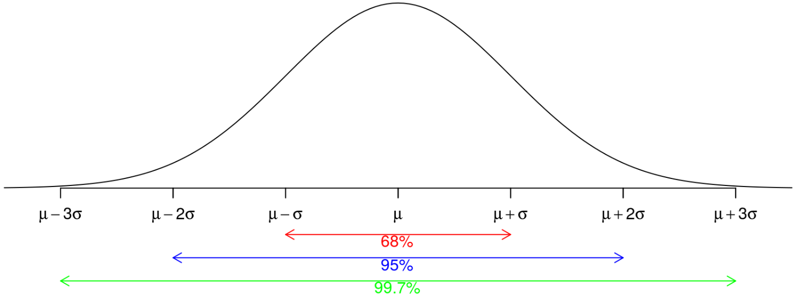

--- 
title: "P2 - Simulering af Data"
author: "Gruppe B2-19"
date: "2020-02-20"
site: bookdown::bookdown_site
output: bookdown::gitbook
documentclass: book
bibliography: [book.bib, packages.bib]
biblio-style: apalike
link-citations: yes
github-repo: rstudio/bookdown-demo
#description: "This is a minimal example of using the bookdown package to write a book. The output format for this example is bookdown::gitbook."
---

# Overskrift


<!--chapter:end:index.Rmd-->

# Problemanalyse

## Kvalitative variabler

De stokastiske variabler kan opdeles i kategoriske eller kvalitative variabler. Ved en kvalitativ variabel fremgår der en enhed, som er den enhed der kategoriseres efter. Udfaldsmængden er de mulige værdier, som kan forekomme ved en undersøgelse af enheden. Dette kunne eksempelvis være nationalitet, hvor der kategoriseres efter land, hvor udfaldsmængen er landene i verden. 

De kvalitative variabler er opdelt efter en nominel og ordinel skala.

Den nominale beskriver variabler, som ikke har en naturlig rangorden, og derved ikke kan rangeres. Ofte er de nominale variabler tekststrenge, men de kan også være numeriske i form af postnumre, dog vil det være meningsløst at foretage beregninger såsom middelværdi eller standardafvigelsen. Eksempler på nominale variabler er køn, hudfarve, nationalitet og hårfarve, da udfaldsmængden i enheden ikke kan rangordnes. Derved skal nominale variabler illustreres ved et cirkeldiagram, da der ikke er givet nogen skala. De udregninger, som der kan foretages på nominale variabler er andele og frekvenser, da disse kun kan skelne udfald.

De ordinale variabler er de kvalitative variabler, som kan rangeres. Eftersom udfaldsmængden er naturligt rangeret, og samtidig er kategorisk, vil det altså være en ordinal variabel. Eksempler på ordinale variabler er økonomisk status, uddannelsesgrad og karakterer. Disse variablers udfaldsmængde er altså rangeret i forhold til hinanden, da det er bedre at være i en høj indkomst fremfor en lav indkomst og ligeledes er det bedre at få karakteren 10 end karakteren 4. Ud fra observationerne kan man efterfølgende blandt andet finde medianen, kvartiler m.m.

Ønsker man at finde middelværdien skal man være lidt påpasselig, eftersom det reelt set ikke giver nogen mening på ordinale variabler. Dog er det muligt at udregne en middelværdi, hvis der er en fælles forståelse af, hvad middelværdien betyder for enheden og hvilken skala, det er udregnet på baggrund af. Når ordinale variabler illustreres, skal det gøres som et søjlediagram efter rangordenen.

[ASTA-bogen s. 12-13]

## Kvantitative variabler

Kvantitative variabler er defineret ved en numerisk  værdi, hvilket gør variablerne målbar. Da en kvantitativ variabel antager en numerisk værdi, kan aritmetriske operationer udføres på variablen. På baggrund af disse simple operationer er det muligt at få informationer ud af et datasæt, der kan skabe indsigt i forhold til fokusområder, som skal undersøges yderligere. Dette er en væsentlig del af dataanalyse, således at ressourcer kan anvendes optimalt.

Et andet essentielt værktøj i dataanalyse er visualisering. På baggrund af middelværdi, varians og standardafvigelse, er det muligt at visualisere data med eksempelvis et histogram eller et boksplot.

Kvantitative variabler kan opdeles i to underkategorier, interval og ratio. Derudover kan disse underkategorier inddeles yderligere i diskrete og kontinuerte variabler. __indsæt figur__ Disse beskrives i et efterfølgende afsnit.

Variabler, der tilhører intervalkategorien, er defineret som variabler, hvor det er muligt at bestemme forskellen mellem to mængder eller to tal. Det kunne eksempelvis være forskellen på temeraturen indenfor, $20 ~^\circ C$, og udenfor, $10 ~^\circ C$.

Variabler, der tilhører ratiokategorien, er defineret som variabler, hvor det er muligt at bestemme forholdet mellem to mængder eller to tal. Det betyder, at der mellem to tal skal være et særligt forhold. Som eksempel på værdier som tilhører ratiokategorien kan være antal hår på hovedet, fart, temperatur målt i kelvin eller tidsforskel. Årsagen til, at temperaturer målt i kelvin, men ikke temperaturer målt i $^\circ$C, tilhører ratiokategorien er, at værdier i denne kategori skal have et naturligt nulpunkt.

### Diskrete variabler

En underkategori til kvantitative variabler er diskrete variabler. En variabel er diskret, hvis man kan tælle værdierne i den, som eksempelvis øjne på en terning (1, 2, ..., 6). En hver variabel der kan beskrives, som “antallet af…” er en diskret variabel. Værdierne i en diskret variabel kan ikke blive opdelt i tal imellem selve værdierne, som eksempelvis kan man ikke sige en person har 2,5 søskende. 

Nominale og ordinale variabler er diskrete variabler. Det kan dog være forvirrende at kende forskel på diskrete og kontinuerte variabler, da man runder kontinuerte variabler op til heltal når man måler dem, så de bliver diskrete. Som eksempelvis med alder, siger man typisk 21 år, når faktisk man er mellem 21 og 22 år. Grunden til at det er vigtigt, at genkende om variablen er kontinuert eller diskret er fordi, at man bruger den viden til at bestemme, hvilken statistisk metode der skal benyttes til at analyserer den givne data. (Kilde: ASTA-bog)


## Kontinuerte Variabler

Hvis den stokastiske varibel antager et overtælleligt antal, siges den at være kontinuert. Et eksempel på en overtællelig variabel, kan være hvis har en undersøgelse, hvor man tager højden på et tilfældigt menneske i populationen. Her kan højden have et antal decimaler, der går mod uendeligt, for eksempel $195,00000003 cm$.

For kontinuerte variabler bruger man tæthedsfunktionen, f(x). Her er arealet under tæthedsfunktionen sandsynligheden for, at en stokastisk variabel, X, befinder sig i intervallet (a, b), givet ved,

$P(a < X < b) = \int_a^b f(x) dx$

Den typiske kontinuerte fordeling er en normalfordeling. Dels fordi den ses i mange målinger i virkeligheden, og dels fordi, den centrale grænseværdi sætning siger, at ved et højere antal observationen, vil alle stokastiske variabler gennemsnitsfordeling antage en normalfordeling. 


## Outliers

En outlier kan beskrives som en observation, der afviger betydeligt fra resten af den stikprøve, observationen stammer fra (WIKI). Denne beskrivelse uddybes neden for, hvor to forskellige metoder til at identificere outliers gennemgås. Afsnittet er skrevet med udgangspunkt i [@ASTA, s. 48-55].

Den første metode til at identificere outliers tager udgangpunkt i fordelingen af observationerne. Hvis fordelingen er tilnærmelsesvis klokkeformet, gælder figur, hvor $\mu$ er middelværdien og $\sigma$ er standardafvigelse.


```r

```

\begin{figure}

{\centering \includegraphics[width=0.75\linewidth]{images/Normalfordeling} 

}

\caption{Figurtekst}(\#fig:unnamed-chunk-2)
\end{figure}

Det gælder altså, at $\approx 68 \%$ af observationerne findes inden for en standardafvigelse fra middelværdien, $\approx 95 \%$ inden for to standardafvigelser og $\approx 99,7 \%$ inden for tre standardafvigelser.

På baggrund af dette, kan en outlier defineres som en værdi, der ligger et vist antal standardafvigelser væk fra middelværdien. Som udgangspunkt siges det, at hvis en værdi er mere end $3$ standardafvigelser væk fra middelværdien, kan den ses som en outlier.

En anden måde at beskrive fordelingen af en observation er ved hjælp af percentiler - et punkt for hvilket en hvis mængde af data antager værdier over eller under. Her en medianen et specialtilfælde af en percentil, 50-percentilen, hvor halvdelen af data antager værdier under punktet, og den anden halvdel over punktet. Generelt defineres en percentil som,

>\BeginKnitrBlock{definition}<div class="definition"><span class="definition" id="def:unnamed-chunk-3"><strong>(\#def:unnamed-chunk-3) </strong></span>__p-percentilen__ er et punkt, således at $p  \%$ af observationerne antager værdier under punktet, og $(100 - p) \%$ af observationerne antager værdier over punktet.</div>\EndKnitrBlock{definition}

To andre særlige tilfælde af percentiler er 25-percentilen, den nedre kvartil ($Q_L$), og 75-percentilen, den øvre kvartil $Q_U$. Ved hjælp af $Q_L$ og $Q_U$ kan variabiliteten af observationerne beskrives som afstanden mellem de to kvartiler. Denne afstand benævnes _Inner Quartile Range_, IQR, og beregnes som $IQR = Q_U - Q_L$.

Når både minimum, $Q_L$, median, $Q_U$ og maksimum er fundet, kan disse benyttes til at tegne et boksplot af observationerne. Et boksplot giver et grafisk overblik af midten og variabiliteten af observationerne. Et boksplot ser ud, som på nedenstående figur.


\begin{center}\includegraphics[width=0.75\linewidth]{images/Boksplot} \end{center}

På baggrund af IQR og boksplottet kan outliers nu defineres som data, der antager værdier mere end $1,5(IQR)$ gange over $Q_U$ eller under $Q_L$.

Outliers er altså værdier, der er ekstreme nok til at påvirke en dataanalyse i forkert retning. Derfor benyttes forskellige metoder til at identificere sådanne outliers, som derefter kan fjernes i en rengøring af datasættet.

<!--chapter:end:01-problemanalyse.Rmd-->


<!--chapter:end:100-bibliografi.Rmd-->

